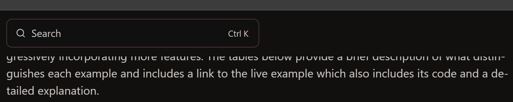
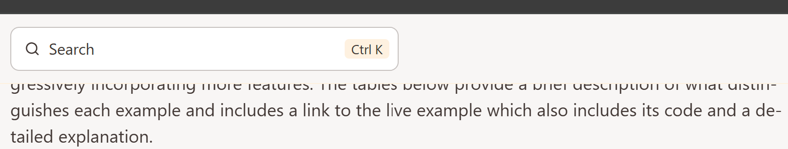
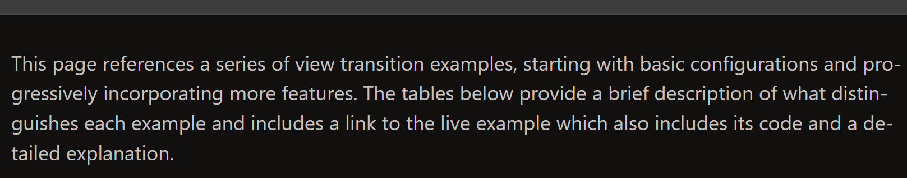
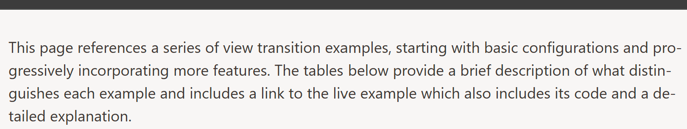

import Media from "@/components/Media.astro";
import SidePicture from "@/components/SidePicture.astro";
import ReloadOnThemeChange from "@/components/ReloadOnThemeChange.astro";

<ReloadOnThemeChange />

View transitions offer a unique capability: all images participating in the transition exist within a shared stacking context, separate from their original elements in the DOM. This setup enables smooth morphing animations between elements found in different parts of the DOM but can also create unexpected behavior. For example, elements that were clipped or partially hidden in the DOM may "break free" of their boundaries during the transition, causing them to appear outside their intended constraints.

Moving [view transition images](/basics/pseudos/#old-and-new-image-pseudos) into the [view transition layer](/basics/pseudos/#rendering-pseudo-elements:~:text=own%20stacking%20context%2C%20known%20as%20the%20view%20transition%20layer) above all other elements can lead to effects that are surprising but are generally also straightforward to address.

## List Elements Gone Wild

<SidePicture>

<a href="/basics/hide-and-seek/problem/" slot="pic">
  <iframe
    width="160"
    style="pointer-events:none; margin-right: 1em"
    src="/basics/hide-and-seek/problem/"
  ></iframe>
</a>

<a name="demo"></a>
During a view transition, elements that were clipped in the DOM often lose their
clipping properties. [Look at this demo](/basics/hide-and-seek/problem/), where
all list items have view transition names. The `overflow: scroll` property
ensures that only elements within the scrollable area are visible. However, as
the view transition starts, all associated transition images, including those
previously clipped, become unbounded and can freely move across the entire
viewport.

</SidePicture>

What is going on and can it be prevented? We'll explore techniques to regain control over such scenarios, ensuring your transitions are visually consistent.

We'll dive into techniques to regain control over these scenarios, ensuring your view transitions maintain the visual consistency you expect.

This website features both subtle and striking examples where pseudo-images pop up in a surprising way. I’ll guide you through some of them to highlight the issues and their solutions.

## Stacking Pseudo-Elements

This site is built with [Astro Starlight](https://starlight.astro.build/). Enabling cross-document view transitions for multi-page sites is surprisingly [straightforward](/fwvt/twinkling/#enable-view-transitions--groups).

Once activated, your site will have full-page cross-fade transitions during navigation. To add a touch of flair, we've assigned the view transition name `main` to the primary content area, creating the corresponding `::view-transition-group(main)` pseudo-element:

```css
main {
  view-transition-name: main;
}
```

Here is an interesting quirk: Scroll down a bit so part of the page content moves beneath the fixed search box at the top of the page.

<Media>
<div class="small">
  <span class="light:sl-hidden">
    
  </span>
  <span class="dark:sl-hidden">
    
  </span>
</div>
<p slot="caption">Text scrolls beneath the header</
p>
</Media>

Now navigate to a different page. During the view transition, the `::view-transition-group(main)` pseudo-element, along with its old and new images, enters the view transition layer. Since these images are taller than the viewport, they obscure the search box momentarily.

<Media>
<div class="small">
  <span class="light:sl-hidden">
    
  </span>
  <span class="dark:sl-hidden">
    
  </span>
</div>
<p slot="caption">Header is obscured by text</p>
</Media>

<style>{`
div.small img,
div.large img {
  border:#888 solid 1pt;
  box-shadow: 0 0 5px 5px #8884;
  background-color: #0000;
}
div.small img {
  margin: 0;
  height: 100px;
  object-fit: cover;
}
div.small {
  width: max(250px, 67%);
  margin-inline: auto;
}
`}</style>

As a result, the search box seems to vanish during the transition and reappear afterward. While this behavior isn't a big deal, it can feel a bit jarring.

To prevent this, we need the search box to visually sit above the `::view-transition-group(main)` images during transitions. However, regular DOM elements cannot render above view transition pseudo-elements. The solution? Assign a view transition name to the searchbox (or one of its parents), forcing it to generate its own images in the view transition layer. These images can then visually cover the main area images. For our Starlight site we do this like this:

```css
header.header {
  view-transition-name: header;
}
mobile-starlight-toc nav {
  view-transition-name: mobile-starlight-toc-nav;
}
```

The first rule targets the header which holds the searchbox. The second line targets the page navigation of the mobile view.

The paint order for old images in the view transition layer mirrors the paint order of their corresponding elements in the DOM. Images exclusive to the new page [are painted after that](/basics/pseudos/#rendering-pseudo-elements). If you need precise control over the stacking order of the pseudo-elements within the view transition layer, you can adjust it by assigning a `z-index` to the group pseudo-element. This is not needed for our Starlight example, as the header renders after the main area and thus the header's pseudo-element will render above that of the main area. But if you are looking for an example, here it is:
```css
::view-transition-group(header) {
  z-index: 1;
}
```

## Clipping View Transition Images

Another approach is to clip view transition images at their corresponding image pair or transition group. For example, this site uses a sliding view transition animation for the main content. Without specific adjustments, this animation would cause the main content to overlap the sidebar on the left and the in-page navigation on the right:

<div class="large">
<Media>
  <span class="light:sl-hidden">
    
  </span>
  <span class="dark:sl-hidden">
    
  </span>
  <p slot="caption">View transition images for main content overlap with
    sidebars</p>
</Media>
</div>

This overlap can be avoided by clipping the old and new images at the edges of their image pair:

```css
::view-transition-image-pair(main) {
  overflow: hidden;
}
```

Activating the Inspection Chamber (and temporarily disabling most of the view transition images for clarity) reveals that the visible portions of the main content are now confined within the dotted yellow box, which represents the boundary of the `::view-transition-image-pair(main)`. The CSS properties shown in the panel to the left confirm that overflow is hidden for the image-pair of the transition group named `main`.

Since the main content areas occupy the same position on both the old and new pages, the browser's default animation for the `main` transition group has no effect during the transition. The group doesn't morph or move, it remains stationary. The combined effect with the clipping is that the view transition of the main content section seems to slide below the sidebars.

<div class="large">
<Media>
  <span class="light:sl-hidden">
    
  </span>
  <span class="dark:sl-hidden">
    
  </span>
  <p slot="caption">View transition images for main content get clipped to their original
    position</p>
  </Media>
</div>

### Clipping at the Group or Image Pair?

The browser’s user agent stylesheet aligns the `::view-transition-image-pair(...)` with its `::view-transition-transition-group(...)` in terms of geometry and transform properties. This means you can use either pseudo-element for clipping purposes, and initially, they will produce the same result.

Since these pseudo-elements are fully customizable through CSS, you can alter their properties as needed. You could resize them, add margins, or tweak other styles to create unique visual effects. For instance, you could retain the default morph animation on the transition group while applying a custom animation to the image-pair for clipping. Let your imagination run wild!

### Nested View Transition Group Clipping


<SidePicture  float="right">
<iframe
  slot="pic"
  style="height:250px; width:200px; border: none;  margin-right: 1em"
  src="/basics/hide-and-seek/list-nested/"
></iframe>

In the early versions of the View Transition API, the transition groups form a flat list of children of the `::view-transition` pseudo element. Nested view transition groups are already defined in the [Level 2 spec](/basics/api/#w3c-drafts), but are [not yet widely supported](/basics/test-page/) by browsers.

Nested view transition groups introduce the ability to clip images not only within their own group but also using their parent or any ancestor further up the hierarchy. The example to the right is built with nested view transition groups. When you press the button, and the demo behaves the same as the one in the next section, your browser does not support nested view transition groups, yet.

If your browser supports the nested `view-transition-group` property, at least the early implementations do not clip the view transition pseudo-elements while the tree is being built. This leads to a flash of elements escaping the box in the first frame.

So until nested view transition groups are widely and well supported by browsers, we have to play some tricks to simulate the clipping. See the next section on how to do that.

</SidePicture>

## Taming Images of Clipped Elements

<SidePicture>

<iframe
  slot="pic"
  style="height:250px; width:200px; border: none;  margin-right: 1em"
  src="/basics/hide-and-seek/list-flat/"
></iframe>

Let’s be real: when an element has a view transition name, it will appear as an image in the view transition layer during the transition. Without support for nested view transition groups, it doesn't even matter if the original element was clipped by its container.

This behavior can work well for elements that naturally feel like they should overflow their container as they glide to a new position. However, it can also result in unexpected outcomes, like images suddenly popping up in places they shouldn't, creating surprising visual effects.

</SidePicture>

If unwanted images appear during view transitions, there are currently two main ways to prevent this (with nested view transition groups as a third option when they become available):


- **Dynamically Set View Transition Names:**
Modify the view-transition-name property just before the transition starts. This allows you to selectively include or exclude elements from the transition, ensuring only the intended elements participate.

- **Obscure Images with Overlapping Elements:**
Place other pseudo-elements above the images you want to hide. These elements can be part of the view transition and strategically positioned to block unwanted visuals during the transition.


### Dynamically Named View Transition

If you want to prevent images of elements popping up, do not assign them a view transition name. For the scrolled list example, visible list elements can be found by comparing their bounding rectangles to the rectangle of the list. You should only name elements that are completely visible. The images of partially visible elements would overlap the border of the list and adjacent elements.

<SidePicture float="right">

<iframe
  slot="pic"
  style="height:230px; width:150px; border: none;  margin-left: 1em"
  src="/basics/hide-and-seek/list-names/"
></iframe>

To simplify things, the upcoming examples ensure that there are no partly visible list items by using scroll snap and adjusting the visible area of the list accordingly. They also do not animate the list elements and do not make them leave their box during view transitions.

The demo to the right determines the first and the last element visible within in the scrolled area. Then exactly those and all elements in between are assigned a `view-transition-name`.

In this example, the rotation is achieved by moving the first list item to the end of the list. Without adjustments, this would cause the first visible element to overflow the list container. To address this, we dynamically change the view-transition-name properties in the DOM. We remove the name from the first visible element and add one to the successor of the last visible element.

By managing the view-transition-name in this way, the View Transition API creates entry and exit animations for the relevant elements, as they are named only in either the old or the new DOM state.

</SidePicture>

#### Limitations

This approach to simulating a scrolling list doesn't perfectly mimic the effect of real scrolling. While the moving elements remain confined within the list's boundaries, there's a notable limitation: the disappearing item at the top and the appearing item at the bottom never transition partially into view. Instead, they just grow in and shrink out.

You can improve this effect by crafting more sophisticated entry and exit animations. However, achieving a convincing clipped appearance requires some effort.

While this method works well for rotations, it's impractical the number of elements entering and exiting gets too high. You can't use this to visualize a complex shuffle where lots of elements fly in, out and through the visible area of the container. For those cases, consider the approach described next.

### Image Concealment with Stencils

Another way to simulate `overflow: hidden` or nested view transition groups is to introduce new pseudo-elements that can hide unwanted images.

<SidePicture>
It might sound a bit weird, to fight unwanted images with even more images, but the idea is simple: put an [additional curtain](/basics/pseudos/#the-theater-curtain) in front of your stage to hide what you don't want the audience to see.

In some cases it might be sufficient to have some rectangles colored in your site's background color, add a `view-transition-name`, and move their pseudo-images into place as part of the view transition. These rectangles might also have children like paragraphs or buttons, which will then show up on top.

<iframe
  slot="pic"
  style="height:320px; width:150px; border: none;  margin-right: 1em"
  src="/basics/hide-and-seek/list-stencil2/"
></iframe>

The list on the left contains two checkerboard `<div>` elements: one before and one after the list. A button is nested within the lower `<div>`. Both `<div>` elements are assigned view transition names, `stencil1` and `stencil2`. As a result, the `<div>`s produce pseudo-elements that act as visual blockers, effectively concealing any list items that overflow beyond their intended boundaries during the view transition.

</SidePicture>

#### Importance of Paint Order

<SidePicture float="right">

To bring pseudo-elements to the front during a view transition, you can adjust their stacking order using the `z-index` property. This allows the pseudo-elements to obscure other images in the view transition layer.

However, keep the following in mind: Pseudo-elements are initially stacked [according to the DOM paint order](/basics/pseudos/#creation-of-pseudo-elements) of their originating elements. This can lead to flashes of unwanted images right at the start of the view transition as in the example to the right.

Such effects can be prevented by just setting the `z-index` property on the DOM elements with the view transition name. A simpler solution is to position the stencils further down in the HTML, ensuring they are naturally higher in the stacking order. Elements that appear later in the DOM usually stack above earlier elements, reducing the need for complex z-index adjustments.

<iframe
  slot="pic"
  style="height:320px; width:150px; border: none;  margin-left: 1em"
  src="/basics/hide-and-seek/list-stencil1/"
></iframe>

#### Beyond Simple Stencils

Stencils do not need to be simple rectangles. Especially when you want to cover all four sides of an area the following trick can come in handy: Here the stencil is a copy of the clipped area with some surrounding elements, featuring a hole in the middle to reveal the original elements.

Stencils don't have to be limited to basic rectangles. Especially when covering all four sides of an area, one approach is to create a stencil that mimics the clipped content, including adjacent elements, but with a cut-out section in the middle. This design allows the stencil to mask unwanted areas while revealing the desired content through the central "window."
</SidePicture>

<SidePicture>

<iframe
  slot="pic"
  scrolling="no"
  style="height:260px; width:170px; border: none;  margin-right: 1em;"
  src="/basics/hide-and-seek/list/"
></iframe>


In our scrollable list example, we overlay the list with a stencil that covers both the list and the surrounding area.  On top of the stencil is a copy of the list and a button. To ensure users interact with the original list beneath, we apply `pointer-events: none` to the stencil.


The stencil has a transparent, rectangular cut-out aligned with the visible portion of the scrollable list, excluding the scrollbar. This effect is achieved by using a mask image on the stencil. As a result, only the list items within the scrollable area remain visible through the cut-out, while all other elements, including the original scrollbar, are hidden. JavaScript keeps the two scrollbars synchronized.


The stencil gets a view transition name assigned to it. During the view transition, the stencil’s pseudo-element appears in front of everything else, as demonstrated when hovering over the orange sketch below.

</SidePicture>

<style>{`
    .container {
      position: relative;
      height: 270px;
      width: 300px;
      margin: 0 auto;
      transform-style: preserve-3d;
      perspective: 50cm;
      transition: transform 1s ease;
      perspective-origin: center center;
    }
    .container:hover {
      transform: rotate3d(1, 0.5, 0.5, -60deg)
    }

    .container div {
      padding-left:0.25em;
      position: absolute;
      margin: 0;
      width: 100%;
      height: 100%;
      background-color: #fff;
      border: 2px solid #ff8000;
      box-shadow: 0 0 10px rgba(0, 0, 0, 0.5);
      transform-origin: center;
      font-size: 12px;
    }
    [data-theme=dark] .container div {
      background-color: #000;
    }

    .container div.small {
      width: auto;
      height: auto;
      background-color: rgba(255, 128, 0, 0.1);
      border: 2px solid #ff8000;
    }
    [data-theme=dark] div.small {
        background-color: rgba(255, 128, 0, 0.1);
    }

    .container div:nth-child(2) {
      inset: 55px 70px 95px 70px;
      transform: translateZ(20px);
    }
    .container div:nth-child(3) {
      inset: 60px 75px 100px 210px;
      transform: translateZ(20px);
    }
    .container div:nth-child(4) {
      inset: 30px 100px 220px 80px;
      transform: translateZ(40px);
    }
    .container div:nth-child(5) {
      inset: 60px 100px 190px 80px;
      transform: translateZ(40px);
    }
    .container div:nth-child(6) {
      inset: 90px 100px 160px 80px;
      transform: translateZ(40px);
    }
    .container div:nth-child(7) {
      inset: 120px 100px 130px 80px;
      transform: translateZ(40px);
    }
    .container div:nth-child(8) {
      inset: 150px 100px 100px 80px;
      transform: translateZ(40px);
    }
    .container div:nth-child(9) {
      inset: 180px 100px 70px 80px;
      transform: translateZ(40px);
    }
    .container div:nth-child(10) {
      inset: 210px 100px 40px 80px;
      transform: translateZ(40px);
    }
    .container div:nth-child(11) {
      inset: 20px 60px 30px 60px;
      transform: translateZ(75px);
      background-color: #dddc;
      mask-image:url('data:image/svg+xml;utf8,<svg xmlns="http://www.w3.org/2000/svg" width="100%" height="100%"><rect width="100%" height="100%" fill="white" /><rect x="10" y="37" width="133" height="117" fill="black" /></svg>');
        mask-mode: luminance;
    }
    [data-theme=dark] .container div:nth-child(11) {
      background-color: #333c;
    }
    .container div:nth-child(12) {
      inset: 190px 80px 60px 150px;
      border-radius: 5px;
      border: 2px solid blue;
      transform: translateZ(75px);
    }
    .container div:nth-child(13) {
      inset: 55px 70px 95px 70px;
      border: 2px solid blue;
      transform: translateZ(75px);
    }
    .container div:nth-child(14) {
      inset: 60px 75px 100px 210px;
      border: 2px solid blue;
      transform: translateZ(75px);
    }

`}</style>

<div class="container not-content">
  <div class="rectangle">DOM</div>
  <div class="rectangle small"></div>
  <div class="rectangle small"></div>
  <div class="rectangle small">1</div>
  <div class="rectangle small">2</div>
  <div class="rectangle small">3</div>
  <div class="rectangle small">4</div>
  <div class="rectangle small">5</div>
  <div class="rectangle small">6</div>
  <div class="rectangle small">7</div>
  <div class="rectangle small">Stencil</div>
  <div class="rectangle small">Button</div>
  <div class="rectangle small"></div>
  <div class="rectangle small"></div>
</div>

These are the main ingredients of the stencil's styling:

```css
#stencil {
  view-transition-name: stencil;
  pointer-events: none;
  mask-image: url('data:image/svg+xml;utf8,<svg xmlns="http://www.w3.org/2000/svg" width="100%" height="100%"><rect width="100%" height="100%" fill="white" /><rect x="1" y="1" width="130" height="200" fill="black" /></svg>');
  mask-mode: luminance;
  ...
}
```

The mask image used is a white SVG with a black rectangle embedded in it. Thanks to the luminance mask mode, the mask becomes transparent where the black rectangle appears. In this example, the coordinates for the mask are static, but they could be dynamically calculated using the bounding client rectangle of the list for more flexibility.

The overall effect is that the list items appear to float behind the scrollbar.

## List Example Revisited

Using the stencil approach on the [original list example](#demo) from the beginning of this article now yields a [much better result](/basics/hide-and-seek/solution/).
