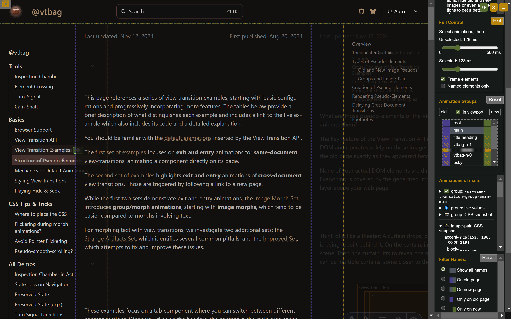
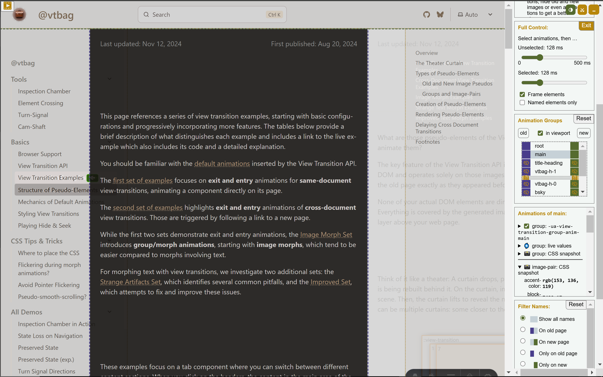
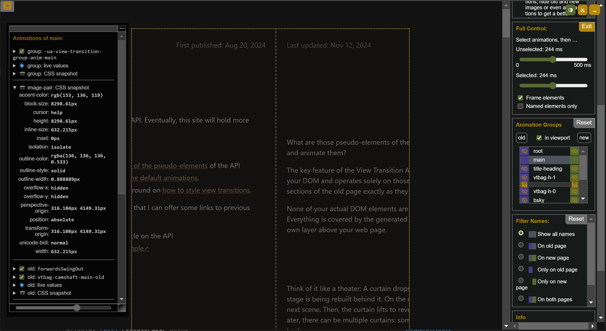
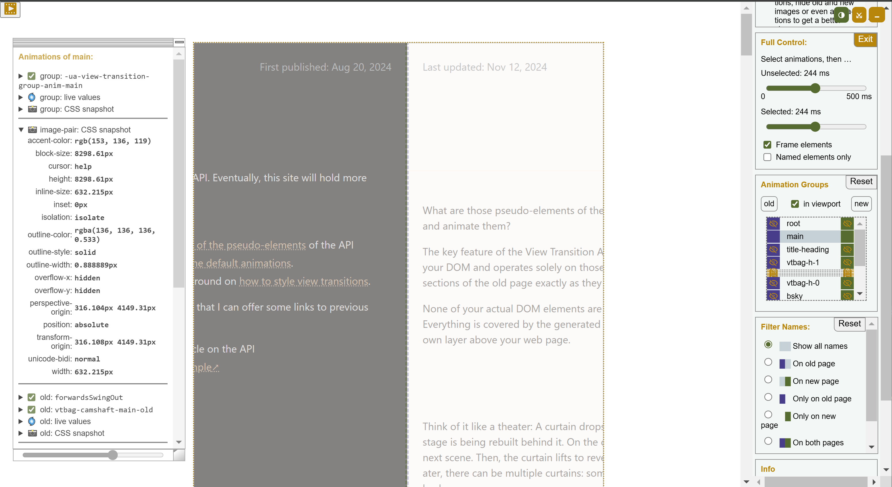

View transitions offer a unique capability: all images participating in the transition exist within a shared stacking context, separate from their original elements in the DOM. This setup is excellent for creating seamless morphing effects between elements, but it can introduce unexpected behavior. For example, elements that are clipped or partially obscured in the DOM might escape their visual boundaries during a view transition, breaking out of their intended constraints.

Here, we'll explore techniques to regain control over such scenarios, ensuring your transitions are visually consistent.

:::note
This page is more of a rough draft than I'd usually share, but I couldn't wait to publish the [`overflow:scroll` demo](#improved-scrollable-list). For now, you'll have to put up with the work-in-progress state, but I promise to refine and complete it soon!
:::

Moving [view transition images](/basics/pseudos/#old-and-new-image-pseudos) into the [view transition layer](/basics/pseudos/#rendering-pseudo-elements:~:text=own%20stacking%20context%2C%20known%20as%20the%20view%20transition%20layer) above all other elements can lead to effects that are surprising but generally also easy to understand and resolve.

This site features both subtle and striking examples. I'll guide you through some of them to highlight the issues and their solutions.

## Restoring Original Paint Order

This is built with [Astro Starlight](https://starlight.astro.build/). Enabling cross-document view transitions for multi-page sites is surprisingly straightforward. [Most browsers](https://caniuse.com/?search=%40view-transition) support this feature; all you need to do is [add a simple CSS at-rule](/tips/css/) to your custom styles:

```css
@view-transition {
  navigation: auto;
}
```

Once activated, your site will have full-page cross-fade transitions during navigation. To add a touch of flair, we've assigned the view transition name `main` to the primary content area, creating the corresponding `::view-transition-group(main)` pseudo-element:

```css
main {
  view-transition-name: main;
}
```

Here is an interesting quirk: Scroll down a bit so part of the page content moves beneath the fixed search box at the top of the page.

<div class="small">
  <span class="light:sl-hidden">
    
  </span>
  <span class="dark:sl-hidden">
    
  </span>
</div>

Now navigate to a different page. During the view transition, the `::view-transition-group(main)` pseudo-element, along with its old and new images, enters the view transition layer. Since these images extend taller than the viewport, they obscure the search box momentarily.

<div class="small">
  <span class="light:sl-hidden">
    
  </span>
  <span class="dark:sl-hidden">
    
  </span>
</div>

<style>{`
div.small img,
div.large img {
  border:#888 solid 1pt;
  box-shadow: 1px 1px 5px #8884;
}
div.small img {
  margin-top: 1ex;
  height: 100px;
  object-fit: cover;
}
div.small {
  width: max(250px, 67%);
  margin-inline: auto;
}
`}</style>

As a result, the search box seems to vanish during the transition and reappear afterward. While this behavior isn't a big deal, it can feel a bit jarring.

To prevent this, we need the search box to visually sit above the `::view-transition-group(main)` images during transitions. However, regular DOM elements cannot render above view transition pseudo-elements. The solution? Assign a view transition name to the searchbox (or one of its parents), forcing it to generate its own images in the view transition layer. These images can then visually cover the main area images. For our Starlight site we do this like this:

```css
header.header {
  view-transition-name: header;
}
mobile-starlight-toc nav {
  view-transition-name: mobile-starlight-toc-nav;
}
```

The first rule targets the header which holds the searchbox. The second line targets the page navigation of the mobile view.

The paint order for old images in the view transition layer mirrors the paint order of their corresponding elements in the DOM. Images exclusive to the new page [are painted after that](/basics/pseudos/#rendering-pseudo-elements). If you need precise control over the stacking order within the view transition layer, you can adjust it using the `z-index` CSS property.


## Clipping Images at other Pseudo Elements

Another powerful technique is clipping view transition images at their image pair or transition group. This website defines a sliding view transition animation for the main content.  Without additional refinements, the content would overlap the sidebar on the left and the in-page navigation on the right:

<div class="large">
  <span class="light:sl-hidden">
    
  </span>
  <span class="dark:sl-hidden">
    
  </span>
</div>

This overlap can be avoided by clipping the old and new images at the edges of their image pair (or at the boundary of their transition group, which has the same position and dimensions):
```css
::view-transition-image-pair(main) {
    overflow: hidden;
  }
```

Activating the Inspection Chamber (and temporarily disabling most of the view transition images for clarity) reveals that the visible portions of the main content are now confined within the dotted yellow box, which represents the boundary of the `::view-transition-group(main)` respectively the `::view-transition-image-pair(main)`. The panel on the left confirms that overflow is hidden for the image pair.

Since the main content areas occupy the same position on both the old and new pages, the browser's default animation for the `main` transition group has no effect during the transition. The group doesn't morph or move, it remains stationary. The combined effect with the clipping is that the view transition of the main content section seems to slide below the sidebars.


<div class="large">
  <span class="light:sl-hidden">
    
  </span>
  <span class="dark:sl-hidden">
    
  </span>
</div>

As of today, the transition groups form a flat list of children of the `::view-transition` pseudo element. Nested view transition groups are already defined in the [Level 2 spec](/basics/api/#w3c-drafts), but to my knowledge they are [not yet supported](/basics/test-page/) by any browser. With nested transition groups you will be able clip images not only at their own group but can also specify the clipping on the parent or another ancestor further up the tree.

Nested transition groups will introduce the ability to clip images not only within their own group but also using their parent or any ancestor further up the hierarchy.


## Simulate


### Naive Scrollable List

Here is a [demo](/tips/hide-and-seek/problem/) of what you get with the naive approach.

### Improved Scrollable List

And this is [what I got so far](/tips/hide-and-seek/solution/)
as a solution.
