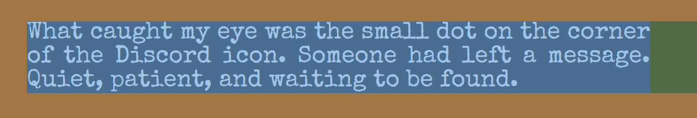

import { Image } from "astro:assets";
import Media from "@/components/Media.astro";
import EpisodeNav from "@/components/EpisodeNav.astro";
import wb from "@/assets/wb.png";
import "@/styles/fwvt.css";

<style>{`
@font-face {
  font-family: 'Special Elite';
  src: url('/fonts/SpecialElite-Regular.ttf');
  font-weight: 100;
  font-style: normal;
}
main .expressive-code pre code,
article {
  font-family: "Special Elite", monospace;
  font-size: 1.2rem;
  font-weight: 100;
  color: light-dark(#321c,#fedc);
}
main .expressive-code pre code {
  font-size: 1rem;
}
strong {
  color: light-dark(#181008,#f8f0e8);
}
`}</style>

<EpisodeNav>
  <span>
    <a href="/fwvt/healing/">Healing</a>
  </span>
  <span>
    <a href="/fwvt/twinkling/">Twinkling</a>
  </span>
  <span class="selected">
    <a href="/fwvt/uncovering/">Uncovering</a>
  </span>
</EpisodeNav>

<portal-gate to="end:head">
  <script is:inline type="speculationrules">{`
    {
      "prerender": [
        {
          "urls": ["/fwvt/healing/", "/fwvt/twinkling/"]
        }
      ]
    }
  `}</script>
</portal-gate>

<article>
<div id="intro">
  <Media>
    <Image src={wb} alt="Fun with The Bag of Tricks and View Transitions" />
    <p slot="caption">Hello, and welcome to _Fun with View Transitions_</p>
  </Media>
  <div>
<span style="font-family: sans-serif; color: var(--sl-color-text); font-size: 1rem;">Hello, and welcome to _Fun with View Transitions_. Today we investigate a strange case of missing view transition animations on mobile!</span><hr/>

A site using view transitions has a problem: the view transition animations do not show up on mobile. Only on mobile, only when a certain fancy display element is on the page. No crash, no console drama, just a cold shoulder from the view transitions.

Feel like poking around the crime scene yourself?
If you're up for the challenge, a minimalistic reproduction awaits at [https:// fun-with-view-transitions.pages.dev](fun-with-view-transitions.pages.dev) (Episode 6).

<hr/><span style="font-family: sans-serif; color: var(--sl-color-text); font-size: 1rem;">Follow the events to uncover what caused this strange behavior and how you can avoid similar effects on your own site!</span>


  </div>
</div>

## Prolog
It was one of those Spring Mondays that arrive too early and stay too long. The kind of day that smells like rain even when the sidewalks are dry, and tastes like coffee that has gone cold in the cup while you were busy chasing ghosts and shadows.

## The Small Dot

What caught my eye was the small dot on the corner of the Discord icon. Someone had left a message. Quiet, patient, and waiting to be found.

Another maintainer had @mentioned me in a #support thread. I knew right away it would not be easy. It never is when they call me.

Others had already tried to help the user, but none of the suggestions had solved the problem.  It just sat there, staring back at them, unsolved and smug.


Curious, I scrolled to the top of the thread and began piecing the story together.

## A Peculiar Bug

A blog, they said. Everything worked like a dream. Except when it did not. On mobile, when opening a particular blog post, the view transitions stubbornly refused to start the animation.

On desktop, everything behaved like nothing had ever been wrong. Smooth as a good jazz record. But on mobile? Nada. No animations at all.

The blog post in question had one thing the others did not: a special component from an external library. Remove the component, and everything worked fine again. The user even sent videos to prove it. Tiny windows into a mystery.


And then things got even stranger: She pointed to another blog of a different user, completely unrelated, broken in the exact same way.
Different town, same shady behavior.


Until now, we had never seen a case like this.


## Down the Rabbit Hole

The third-party library in question was immensely popular.
Respectable. Used by countless sites.
If it were the culprit, someone would surely have noticed by now.

There might be edge cases where bugs can hide within the ClientRouter (f.k.a. &lt;ViewTransitions>), Astro's wrapper around the View Transition API.  I feel responsible for that code and I owed it to the case (and maybe to my own sense of stubborn pride) to dig in.

The videos did not tell me much, and the error pattern did not ring any bells either.
Normally, things either work or they don't. Not this halfway nonsense, mobile-only, one-page-here-one-page-there circus.


I asked the user if she could provide a reproduction I could dig into.
A way to recreate the crime scene in a controlled environment.

What she delivered was outstanding. A simple reproduction based on one of the most common Astro starter themes, using just two pages, and a clear, step-by-step guide on how to trigger the bug.

The bug did not show its face on iOS Safari. It stayed hidden on Firefox as well, where Astro fakes view transitions due to a lack of native support.

I thanked her properly and wrote, "This is so mysterious, it promises to be a lot of fun."
At that point, I did not yet know just how much fun was waiting for me.

## Following the Trail

With the reproduction in hand, I dug in.
At first, there were no obvious clues.
No errors in the logs.
Devtools simply showed that the view transition animations did not even start on mobile.

At least there was one break: I could reproduce the bug using Chrome's mobile emulation on desktop. (There are few debugging horrors worse than needing a real phone.)

First stop was the ClientRouter. Maybe something went wrong there? I wanted to see where it might bail out or fail to start the transition. The ClientRouter code seemed fine.

In fact, the view transition was not being aborted midway through. The animations simply never even started.

## Crossing Off Suspects

I made a list of reasons why view transitions might (silently) fail:
- A second view transition interrupting the current
- Explicit call of skipTransition
- The documents visibility state is "hidden"
- Errors inside the update function
- The update function stalls for too long
- Not even :root has a view-transition-name
- Duplicate view-transition-name values
- Size change of the snapshot containing block
- Errors while capturing snapshots
- Broken CSS rules for the animations
- Use of undefined keyframes

None of these conditions seemed to apply.

I paused for a moment. This was starting to feel like a puzzle without all the pieces, one where the more I looked, the more the solution slipped away. Every piece of the investigation so far had turned out to be a red herring. What if the bug wasn't in the code at all? What if I was missing something simple?

## Stripped to the Bones
I began stripping down the provided reproduction even further, gutting it until it barely resembled a site anymore. But no matter how much I slimmed it down, the error stubbornly remained.

I stripped the ClientRouter too. Hollowed it so much that it did almost nothing anymore, except call the native View Transition API directly. No error handling, no AbortController, no page fetching or calling scripts of the new page.

Then I even removed Astro itself from the equation and built directly against the View Transition API.
Still broken.

That, at least, was good news:
- No longer being called meant the problem clearly wasn't rooted in the third-party library's code.
- And with nothing of it left standing, it was clear the root cause was not hiding in the ClientRouter either.

Which left only one suspect standing:\
CSS styles.

## Pressing From Both Ends
At that time, I started a second investigation from the bottom up, building a fresh project from scratch and adding pieces one by one, waiting for the bug to reappear.

Two parallel investigations. One top-down, one bottom-up.
But while the top-down repro kept the bug alive, oddly enough, the bottom-up project could not reproduce the bug.

Several times, when switching between mobile and desktop mode, I got sidetracked, forgot to turn back on mobile emulation, and chased shadows down empty alleys.

It nagged at me.
Two almost identical projects, only one broken.


What was different?

## A Tiny Clue

It was late.
Too late.
The kind of late where you start seeing things in reflections that are not there. And that was when finally, it clicked.

While watching the transition fail for the hundredth time, I noticed something tiny, almost subliminal:
the button I clicked to trigger the transition was... smaller after the swap.

A chill ran down my spine.
Not metaphorically, physically.

Had the button... shrunk?

The button had not shrunk.
The entire viewport had zoomed out.  Somehow I must have pinched the touchpad. Classic me, trying to zoom in on a bug and zooming out the entire page instead.


Just a tiny bit. But enough so that the browser  allowed me to zoom out a bit.

This shouldn't be possible, and it wasn't on desktop. The page shouldn't be wider than the viewport, but in Chrome's mobile emulation, it suddenly was.



## The Viewport Trap

I knew I could control zooming on mobile with the viewport meta element. But I never bothered to learn the details. I just kept dragging the same old line through every project like a lucky coin I never looked too closely at.

```txt
<meta name="viewport" content="width=device-width, initial-scale=1.0">
```

Would restricting scaling help? I swapped out "initial-scale" for "**minimum-scale**", just to prevent the browser from zooming out.

```txt
<meta name="viewport" content="width=device-width, minimum-scale=1.0">
```
**That fixed everything.** Just like that.

No ghost. No error.
The perp was nailed.

But to be honest, I had no idea how it came to that. Or why it tripped up the view transition in the first place. If anything, it had to do with the snapshot containing block changing size. That was the likeliest lead.


I dove back into the [spec](https://drafts.csswg.org/css-view-transitions-1/#snapshot-containing-block-concept). Maybe for the hundredth time, still trying to make sense of what that snapshot containing block was really up to.

I always figured on mobile "snapshot containing block" meant the whole viewport, browser chrome and all. Maybe that was lazy. Maybe not. Broken animations. Size changes. The pieces were on the table, but the picture still wasn't clear.

And there it was in the spec, hidden among dry lines of technical language:
> If the transition's initial snapshot containing block size is not equal to the snapshot containing block size, skip the transition.

Plain English translation:
If the viewport changes size between capturing old and new images, you are dead.

## What Really Happened

But how could that block change on mobile? The viewport sure as hell did not change during the transition. It's hardware, after all. "Hard" as in: Hard to change size. Has no resize handle.

While that thought was bouncing around in my head, something started to click. It was not the hardware. On mobile, it is all smoke and mirrors: a virtual space they call the layout viewport. And that thing? It ain't the same as the physical screen. Never was. Supposedly only changes when you zoom. Right?

But what if the DOM update during the view transition nudged the layout viewport just enough to make the whole thing stumble? Should be impossible. I had my overflows clipped.

I was getting a headache. Not the kind a cigarette and a strong coffee could fix. I needed proof. Real proof, not the kind you get from asking a hallucinating AI about it.More than a hunch. More than a gut feeling on a rainy night.

I reverted the meta viewport and logged window.innerWidth before and after the transition. It jumped from 414 to some larger value. I couldn't believe it. Nothing on screen looked different. No visible resize. Just a bit of space that crept past the right edge, completely out of sight. But suddenly, I could scroll sideways. Zoom out, too.

Turns out the browser was tricked. Some invisible margins piled up to tip the scale past the device width. The browser responded by quietly stretching the layout viewport, doing what it thought was helpful.

The View Transition API took one look at the mismatch, old snapshots at one size, new ones at another, and did exactly what the spec told it to do:
It skipped the transition.

It was the last thing I expected, but sometimes the simplest answer is the most elusive one. And with that, I could finally make sense of the situation&hellip;

## Lessons from the Case
Skipped animations triggered by viewport changes can rattle your nerves. True for mobile, true for iframes. Hard to spot, easy to misread.

The tricky part with viewport zooming is that it only affects the layout viewport, not the visual viewport. The layout viewport is the one you work with in JavaScript, and that's what can change its size. Even though you'll never see it happen, view transitions rely on its stability.

When you hear size change, you might think of the usual suspects: pinching the screen to zoom, flipping the device to switch orientation.


But the real trouble? That can come from the browser itself. All smiles on the outside, quietly adjusting the layout to offer a "better" experience on mobile. A trick it would never dare pull on desktop.

Now that this story rattled your nerves a little, you will not forget to keep that possibility in mind the next time things go sideways.

Fixes are straightforward, once you know where to look and what to look for:
* Understand your box models. Sizes and margins should not add up to more than 100%, or at least not leak into the viewport.
* Setting overflow to clip on the &lt;body> proved useless for this case in Chrome. But clipping the actual container of the overflowing box finally solved the issue.
* If things still go south, you can tighten the reins on zooming with the viewport meta element.

Got the itch to see for yourself? Then take a look under the hood. \
The [minimal reproduction](https://fun-with-view-transitions.pages.dev/episode/6/page.html) is waiting for you.

## Epilogue
Uncharacteristically for a story like this, it ends with answers. The cause is known. The fixes are clear. Everyone walks away a little wiser, with a few new tricks tucked in their coat pocket, and their animations dancing again just like they should.

And what about this bug not showing its face on iOS?

Fact is, in this case, Safari kept its cool. Chrome didn't. One resized the layout viewport, the other didn't. Which one got it right? I have no clue. And maybe that is not even the point. You cannot control what people use to browse your site.

Maybe someday the behaviors will converge. Maybe not.
The future will tell. It always does.
</article>