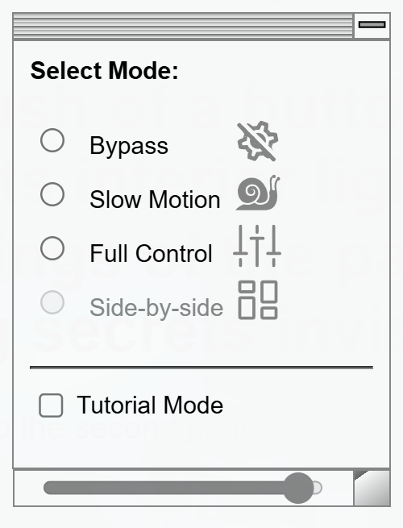
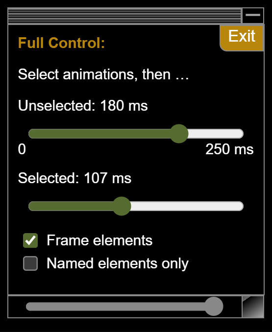
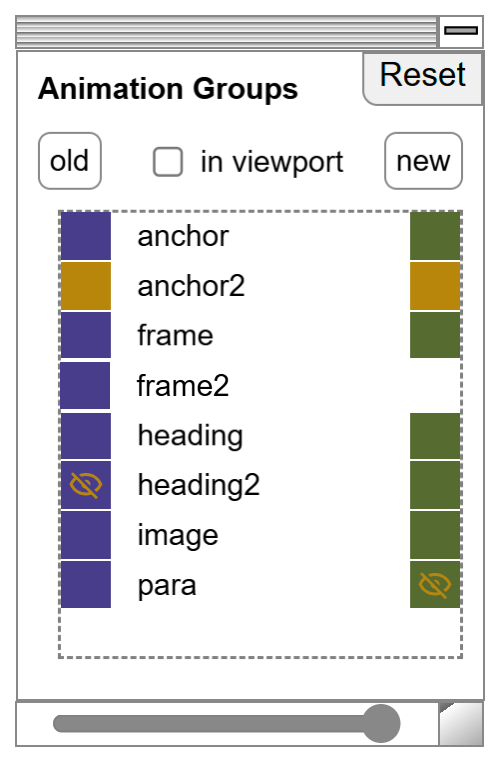

import { Steps } from "@astrojs/starlight/components";

<div style="display:flex">
<div id="logo" style="flex:1; margin: 3ex">

</div><div style="flex:3">
The Inspection Chamber allows you to examine the details of view transitions. It’s designed for use during development and supports both same-document and cross-document view transitions.

Place your pages in the Inspection Chamber and put the view transitions through their paces.
You can thoroughly examine each transition: play it in slow motion, examine timings step-by-step, disable transitions or highlight the pseudo elements &mdash; everything is easily achievable here.

</div>
</div>

<style>{`
  #logo img {
    view-transition-name: logo;
    mask-image: radial-gradient(
        ellipse at center,
        white 35%,
        transparent 71%
      );
  }
`}</style>

<div style="padding: 10px 20px 20px; border:12px dotted orange; width: max-content; border-radius:20px;font-size:32px;transform:rotate(3deg) translateY(20px) translateX(40px)">
  [See it in action!](/inspection-chamber-demo/first-page/)
</div>

## PREREQUISITE

:::danger[Dependency on View Transition API]
The Inspection Chamber requires a current **Chrome browser version 126 or higher**, and on some versions you must also manually activate **chrome://flags/#view-transition-on-navigation-iframe**  .
:::

The Inspection Chamber currently only works with **Chromium browser (Chrome, Edge, \hellip;), starting from version 126**. Additionally, you **might need to enable the _"viewTransition API for sub-frame navigations"_ feature**, because the Chamber will only work if cross-document view transitions are also supported inside iframes. If you have to enable this feature manually, enter `chrome://flags/#view-transition-on-navigation-iframe` into the browser's address bar and select `Enabled` from the drop-down menu.


## Installation

:::tip
If you want to use the Inspection Chamber with an Astro project, see [astro-vtbot](https://events-3bg.pages.dev/library/InspectionChomber/) for instructions. In Astro, the Chamber can be opened from the devToolbar!
:::

To start up the Inspection Chamber on your pages, you can install the npm package in your project. Alternatively you can load the script from one of the global content delivery networks that provide npm packages.

import { Tabs, TabItem } from "@astrojs/starlight/components";

<Tabs>
  <TabItem label="Using the npm package" icon="seti:npm">
    <Steps>
1. Install `@vtbag/inspection-chamber@latest` from npm.
2. In your project, add `@vtbag/inspection-chamber/lib/index.js` as an inline script at the beginning of the `<head>` element on all pages that use view transitions.
</Steps>

Details depend on your project setup and the frameworks used, but it can be as simple as:

```jsx
import chamber from "@vtbag/inspection-chamber?url";

<html>
  <head>
    <script src={chamber} />
    ...
  </head>
  ...
</html>;
```
  </TabItem>
  <TabItem label="Loading the script from a CDN" icon="cloudflare">

You can load the script from CDNs such as jsdelivr.net or unpkg.com. Place the script inline at the beginning of the `<head>` element on all pages that use view transitions.

Using `jsdeliver.net`:

```html
<html>
  <head>
    <script src="https://cdn.jsdelivr.net/npm/@vtbag/inspection-chamber" />
    ...
  </head>
  ...
</html>
```

or alternatively using `unpkg.com`:

```html
<html>
  <head>
    <script src="https://unpkg.com/@vtbag/inspection-chamber" />
    ...
  </head>
  ...
</html>
```
  </TabItem>
</Tabs>

## Inspection Modes

<style>{`#modes{display:flex;} #modes span{flex: max-content} #modes img {padding-right:2ex}`}</style>
<div id="modes"><div style="width:120%;"><span class="light:sl-hidden">

</span><span class="dark:sl-hidden">

</span></div><div style="margin-top:0">

The Inspection Chamber supports different modes of inspection. Common to all modes is the ability to examine the pages before and after the view transition and the requirement to explicitly start the view transition under examination to invoke the selected inspection mode.

For details see the [description of the modi](#bypass) below.

Hint: If selected, Tutorial mode prominently displays usage instructions!

</div></div>


<Steps>

1. <b>Choose an inspection mode</b> from Bypass, Slow Motion or Full Control.

2. <b>Highlight elements with view transition names</b> by selecting the [frame elements
   toggle](#frame-elements).

3. While no transition is active: <b>Identify elements with view transition names</b> by clicking on them on the screen or in the [name list](#name-list). To prevent active elements like links from starting a navigation during examination, hold both, the <kbd>Ctrl</kbd> and <kbd>Shift</kbd> while clicking them.

4. <b>Start a view transition</b> by clicking its trigger such as a link or a button
   on the page.

5. While a transition is active: <b>Identify pseudo elements</b> by clicking on them on the screen or on a name in the name list. Hide some old or new images to get a better view on the details you want to examine.

6. <b>Drill down into the animations.</b> In Full Control mode, see what animates the pseudo elements, and even disable single animations if you'd like to better understand how the overall effect is composed from individual pieces.

7. <b>End the current view transition:</b> In Bypass and Slow Motion modes, the view
   transition will play once and then end automatically. Full Control mode must be
   ended explicitly. To do this, either click the "Exit" button in the Full Control
   panel, click on the [Play Indicator](#play-indicator), or select another inspection
   mode.

</Steps>

Note: View transitions are automatically skipped by the browser if the window is resized or its orientation is changed.

### Bypass

Bypass mode does not intercept the transition but just shows the normal animations.

### Slow Motion

Use the slider to set a time stretch factor and see the view transition in slow motion.

### Full Control

<style>{`#full-control{display:flex} #full-control span{flex: max-content} #full-control img {padding-right:2ex}`}</style>
<div id="full-control"><div style="width:100%"><span class="light:sl-hidden">

</span><span class="dark:sl-hidden">

</span></div><div style="margin-top:0">

Here you got two sliders: The lower slider animates the initially empty set of selected transition groups. The upper slider controls all other elements. Thus if you do not select transition groups, the upper slider controls all groups.

Use the [Name List](#name-list) to select one or more transition groups to be controlled by the lower slider. In Full Control mode, clicking a selected name unselects it. You can reset all names by pressing the reset button of the name list.

To exit Full Control mode, click the exit button in the full control panel or click the [Play Indicator](#play-indicator) in the upper left corner of the page.

</div></div>

## Name List

<style>{`#names{display:flex} #names span{flex: max-content} #names img {padding-right:2ex}`}</style>
<div id="names"><div style="width:200%"><span class="light:sl-hidden">

</span><span class="dark:sl-hidden">

</span></div><div style="margin-top:0">

The list shows the names of elements with view transition names and as soon as a view transition starts, it shows the names of the view transition groups. Clicking in the list highlights (pseudo) elements in the page. Clicking (pseudo) elements in the page, highlights the name in the list.

Identifying elements this way also copies a selector to the clipboard that can be used to select the element in the browser's development tools. To do this, paste the selector into the console window and hit return.

During view transitions, the name list shows a purpleish square to the left and/or a greenish square to the right of a name if the group has a old-image (purpleish) and/or a new-image (greenish). If the images are outside of the viewport, the color changes to a shade of orange. You can click those squares to hide/unhide the images on the page. This can be particularly useful when you want to examine details of crowded areas of the page.
</div></div>

Extra: click the <kbd>new</kbd> and <kbd>old</kbd> buttons above the name list to switch the visibility for all names at once. This is handy if you want to hide all but one image, for example.

## Animation Panel

Each of the pseudo-elements introduced by the view transition API may feature multiple animations, either automatically generated by the browser or defined using CSS. Here, you can see them all. Dive into the details or disable specific animations to understand how each one contributes to the overall effect.
<div class="light:sl-hidden">

</div><div class="dark:sl-hidden">

</div>
You may see entries that do not have a checkmark but show a ⚠️ instead. This means that the key frames of the animation could not be found. A ⚠️ instead of the list of animated properties indicates that there may be errors in the definition of the keyframes.

## Filter Panel

<style>{`#filter{display:flex} #filter span{flex: max-content} #filter img {padding-right:2ex}`}</style>
<div id="filter"><div style="width:100%"><span class="light:sl-hidden">

</span><span class="dark:sl-hidden">

</span></div><div style="margin-top:0">

You can restrict the entries in the [Name List](#name-list) by specifying a fragment of their name. During an active view transition, you can also filter the entries based on the presence or absence of their old and new images.

</div></div>

## Toggles

### Frame Elements

Toggle the option to add a frame to specific elements:

When no view transition is active: frame elements with a view transition name.
When a view transition is active: frame the pseudo elements.

### In Viewport

If this toggle is checked, the [Name List](#name-list) only displays groups that are within the viewport. Other entries are collapsed into a thin dotted line.

### Tutorial Mode

Usage instructions are displayed so prominently that you can hardly see the screen.

## Panel Controls

### Play Indicator (⯈)

The play indicator in the upper left corner shows that a view transition is currently active. Click it to stop the view transition. You'll also notice that the headings of the panels change color while the indicator is visible.

### Dark / Light mode (◑)

What you would expect.

### Switch Panel Side (⤪)

Select your preferred celestial direction.

### Standby (🗕)

Collapses the panel and shows a small standby indicator instead. The indicator can be freely positioned on the screen. Click it to reactivate the panel.

### Resizing the Panel (⇼)

You can grab the border of the panel to resize it.

### Enlarge Sub-Panels (⊟)

Click on the headings of sub-panels to enlarge them. Another click on the heading will switch the panel back. The enlarged panel also has a button at the upper right to return it to the side panel.

### Move the Sub-panel (𝄛𝄛𝄛)

Drag the enlarged sub-panel by the top border to move it freely around.

### Resize the Sub-panel (◩)

Drag the handle in the lower right corner to resize the enlarged sub-panel.

### Reduce the Sub-panel's Opacity

With the slider in the bottom border of the enlarged sub-panel you can increase its transparency.

## Additional Notes

### Sporadically appearing red headings

With a large number of view transition names on a page, the Inspection Chamber can overheat. If you see some dark red headings, be patient and give it a moment to cool down.

### Stability

The implementation depends on Chrome's ability to The implementation relies on Chrome's experimental ability to support cross-document view transitions in iframes. There may still be many flaws, possibly due to my understanding of the new technology. Changes to the underlying browser implementation are likely to impact the functionality of the Inspection Chamber. Please keep me informed of any malfunctions you observe.
