### Goal
We want to spiff up the image carousel example with a custom shrink and grow animation.

### Changes

We built on the [former example using default animations](/demo/BasicC1/). The extensions are CSS only.

#### View Transition Names
We do not want to shrink the whole viewport but only the image. Therefore the first thing is to assign a transition name to the image. We add the property using inline styling for the `` element:
```html 'style="view-transition-name: img"' del={2} ins={1}
  
```
This also has to be done on the second page for the `chamber.webp` ``.

#### Custom Animations

Setting the animation duration is substituted by a bit more complex animation:
We want the old image to shrink to a point and the new image to grow from a point.
Both animations use the same `zoom-out` keyframes, but for the zoom-in effect they are run in reveres order.  The `forwards` definition says that the old image should stay hidden at the end of the transition. Both animation run for a second in parallel without any delays.

```css del={1-3} ins={4-9}
::view-transition-image-pair(root) {
  animation-duration: 0.75s;
}
::view-transition-old(img) {
  animation: 1s zoom-out forwards;
}
::view-transition-new(img) {
  animation: 1s reverse zoom-out;
}
```

The effect reduces opacity and scale of the old image form 1 to 0 and at the same time increases opacity and scale of the new image from 0 to 1. There is a plato from 0.4s to 0.6s where all values are half.

```css ins={1-14}
@keyframes zoom-out {
  40% {
    transform: scale(0.5);
    opacity: 0.5;
  }
  60% {
    transform: scale(0.5);
    opacity: 0.5;
  }
  100% {
    transform: scale(0);
    opacity: 0;
  }
}
```
## Inspection Chamber Insights

When we select the Full Control Mode of the chamber we can check the definitions of the animations and have a closer look on how the animations behave.

<div style="display:flex; flex-wrap:wrap; justify-content: space-around;"><div class="item" style="min-width: 300px;">

### Animations
First we take a look at the animations of the `img` view transition. There is an auto-generated animation for the group and our two animations for the exit and enter animations.

The auto-generated `-ua-view-transition-group-anim-img` is not interesting in our case. It move the images from the old position to the new one, which are both the same.

We expand our zoom animations and see how the browser automatically filled in the opacity and transformation values for the 0% position.

We also see some animation defaults, which we haven't set explicitly like the ease timing function or the 0s duration-delay.

</div><div class="item">

<span class="light:sl-hidden">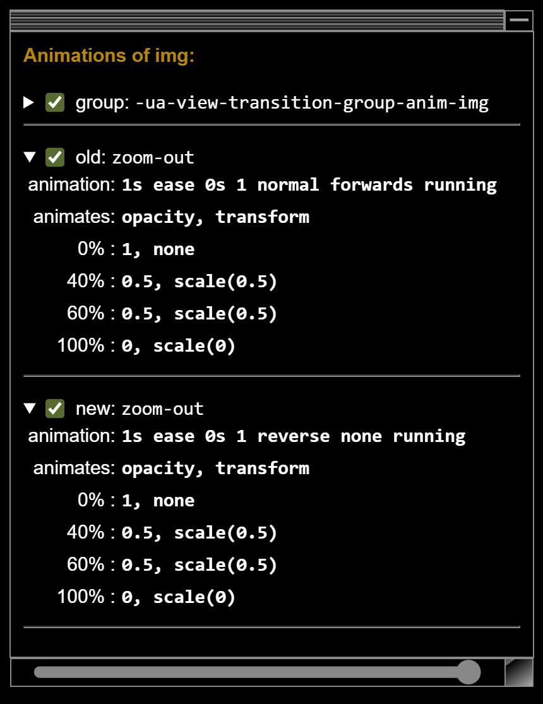</span>
<span class="dark:sl-hidden">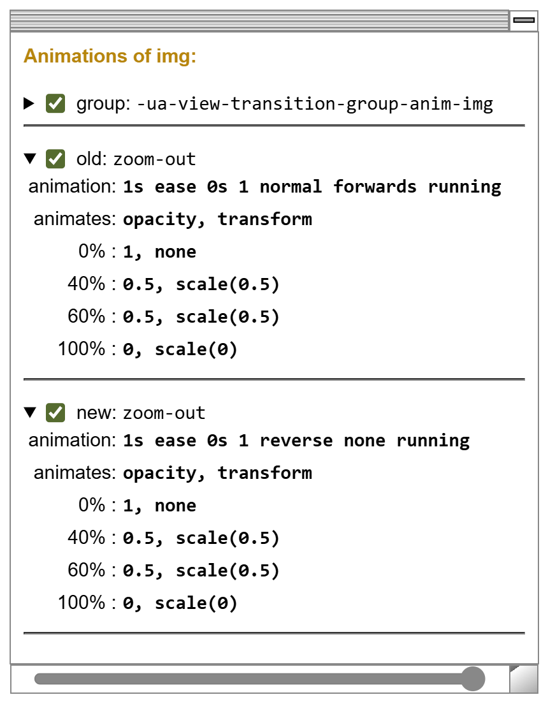</span>

</div></div>

<style>{`
.item {
  flex: 1;
}
.item img {
  width: 300px;
}
`}</style>

### Images

Now we want to have a detailed look at the images as they transition in and out.

<div style="display: flex; flex-wrap: wrap; justify-content: space-around;">

<div class="imgItem">
<span class="light:sl-hidden"></span>
<span class="dark:sl-hidden"></span>
<span class="t">t = 0 ms</span>
</div>
<div class="imgItem">
<span class="light:sl-hidden"></span>
<span class="dark:sl-hidden"></span>
<span class="t">t = 150 ms</span>
</div>
<div class="imgItem">
<span class="light:sl-hidden">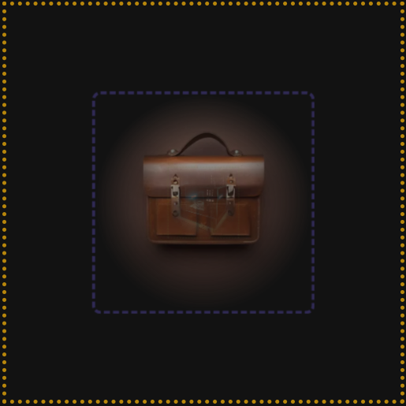</span>
<span class="dark:sl-hidden">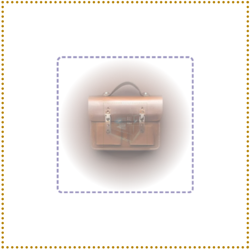</span>
<span class="t">t = 250 ms</span>
</div>
<div class="imgItem">
<span class="light:sl-hidden">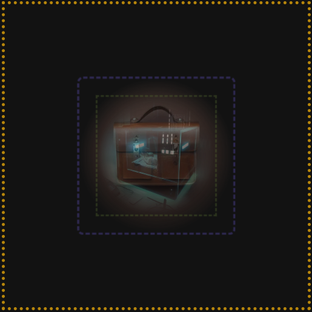</span>
<span class="dark:sl-hidden">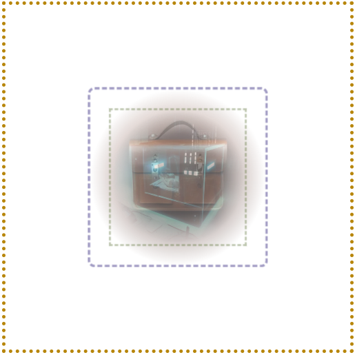</span>
<span class="t">t = 333 ms</span>
</div>
<div class="imgItem">
<span class="light:sl-hidden">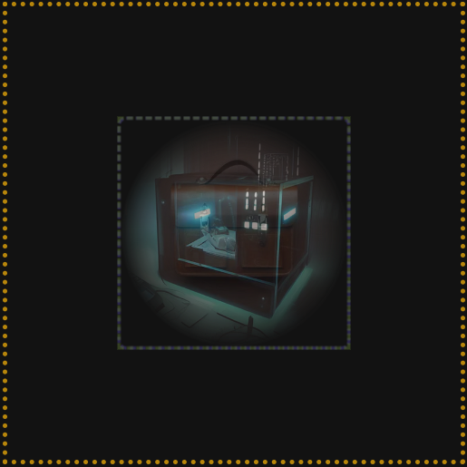</span>
<span class="dark:sl-hidden">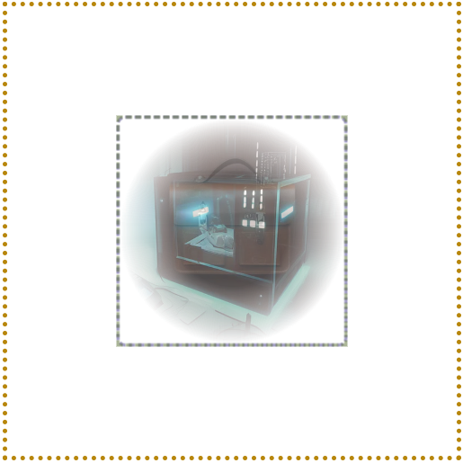</span>
<span class="t">t = 400 ms &mdash; 600 ms</span>
</div>
<div class="imgItem">
<span class="light:sl-hidden">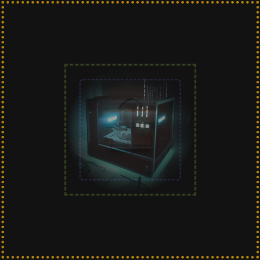</span>
<span class="dark:sl-hidden">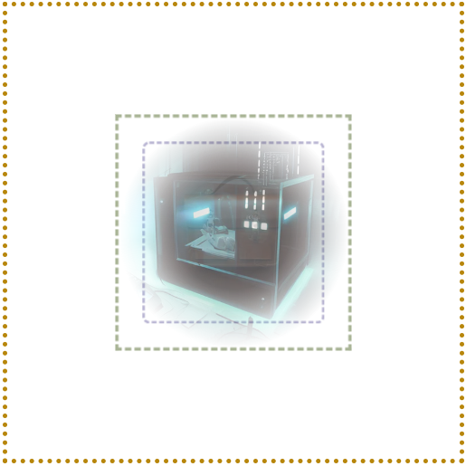</span>
<span class="t">t = 666 ms</span>
</div>
<div class="imgItem">
<span class="light:sl-hidden">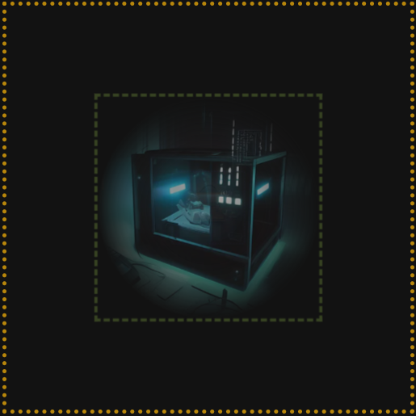</span>
<span class="dark:sl-hidden">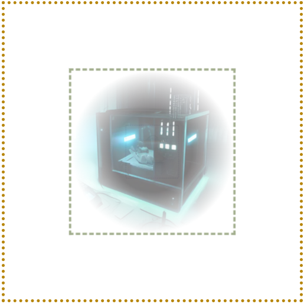</span>
<span class="t">t = 750 ms</span>
</div>
<div class="imgItem">
<span class="light:sl-hidden">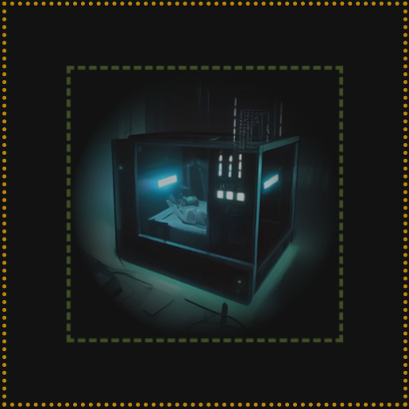</span>
<span class="dark:sl-hidden">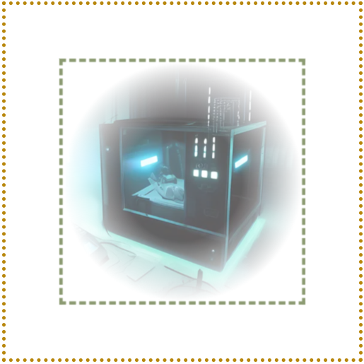</span>
<span class="t">t = 850 ms</span>
</div>
<div class="imgItem">
<span class="light:sl-hidden">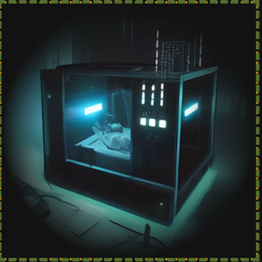</span>
<span class="dark:sl-hidden">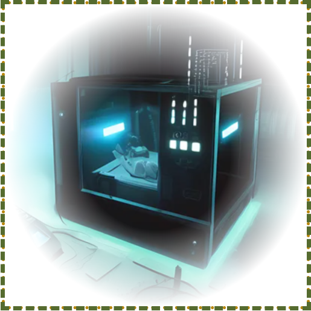</span>
<span class="t">t = 1 s</span>
</div>

</div>
<style>{`
.imgItem img {
  width: 150px;
 }
.imgItem:nth-child(5) {
  flex: 1 1 100%
}
.t {
  text-align: center;
  display: block;
  color: #888;
  font-size: 0.9rem;
  transform: translateY(-20px)
}
`}</style>

The yellow frame shows the `::view-transition-group(img)` pseudo element. It does not change through the animation. The `::view-transition-old(img)` has a purple frame, the `::view-transition-new(img)`'s frame is green. From _t = 400 ms_ to _t = 600 ms_ both images occupy the same space and their frames coincide. Both are half size and  half opaque.