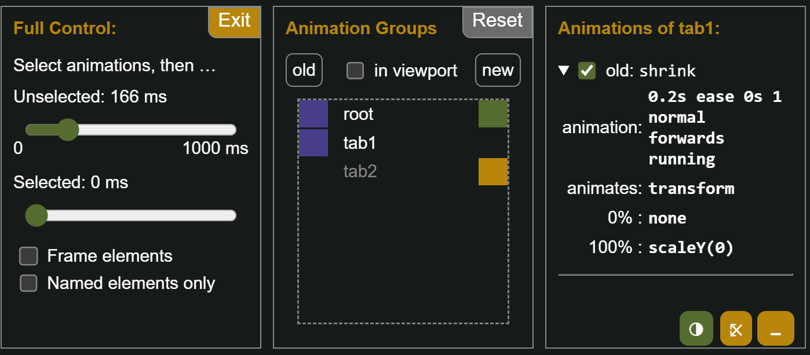
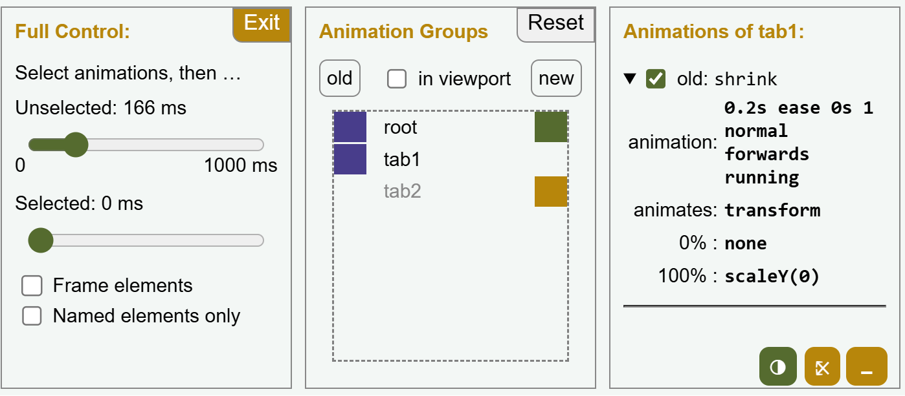
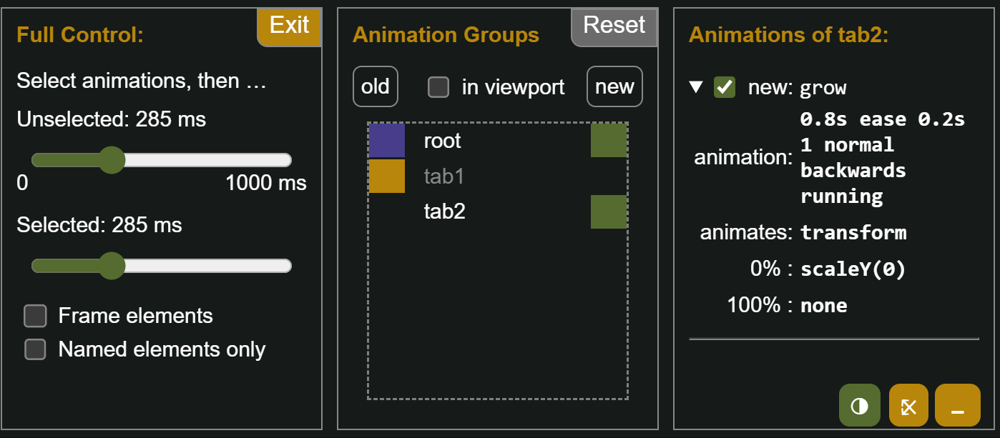

### Goal

This example features a display with two tabs. Clicking a tab slides in the content. The height of the active content area shrinks to zero and after that the new content expands starting from zero to its full height.

### Changes
The code of this example is mainly identical with the [example using default animations](/demo/BasicS/). The extensions are pure CSS.

#### View Transition Names

Because we do not want to animate the whole viewport in a single animation but rather the single content areas, we start with assigning view transition names to the two content areas.

```css ins={1-6}
#tab1 {
  view-transition-name: tab1;
}
#tab2 {
  view-transition-name: tab2;
}
```

However, the default name "root" has not been removed: the page around the tabs will continue to change with the standard transition effect.

#### Custom Animations

Next thing is to define the animations: We shrink the old images until they are gone and after that we let the new images grow in. Note that shrinking and growing have a duration of 0.2s and 0.8s respectively, but growing only starts after a 0.2s delay. This way growing happens after shrinking.

```css del={1-3} ins={4-13}
::view-transition-image-pair(root) {
  animation-duration: 0.75s;
}
::view-transition-old(tab1),
::view-transition-old(tab2) {
  animation: shrink 0.2s forwards;
  transform-origin: top;
}
::view-transition-new(tab1),
::view-transition-new(tab2) {
  animation: grow 0.8s 0.2s backwards;
  transform-origin: top;
}
```

The fill mode settings are also important in this example. To be honest, I usually set them to “both” if it is relevant. If all your animations start at the same time and have the same duration, you don't need to worry about it at all. However, in this example, the total duration of the animation is 1 second, and the two animations only take up a fraction of it each. Therefore, we instruct the shrink animation to leave the old tab invisible after the shrinking (forward), and we instruct the grow animation to be invisible from the beginning (backwards), although there is a delay of 0.2s before the animation starts.

#### Keyframes

Finally, the keyframes for shrinking and growing must be defined:

```css ins={1-10}
@keyframes shrink {
  to {
    transform: scaleY(0);
  }
}
@keyframes grow {
  from {
    transform: scaleY(0);
  }
}
```

Where are the values for the start of shrinkage and the end of growth? These are implicit. The browser substitutes the current values, i.e. normal size or `scaleY(1)`.

## Inspection Chamber Insights

When inspecting a switch from `tab1` to `tab2` in The Chamber, looking at a time frame before 200 ms reveals that
* `root` has an old an a new image and both are visible.
* `tab1` only has an old image, which is visible right now. The only animation defined on this pseudo-element is `shrink`
* `tab2` only has a new image, which is not yet visible.

<span class="light:sl-hidden"></span>
<span class="dark:sl-hidden"></span>

When moving to a time frame beyond 200 ms, things change:
* Now the old image of `tab1` is invisible and
* the new image of `tab2` is visible and transformed by the `grow` animation


<span class="light:sl-hidden"></span>
<span class="dark:sl-hidden"></span>
