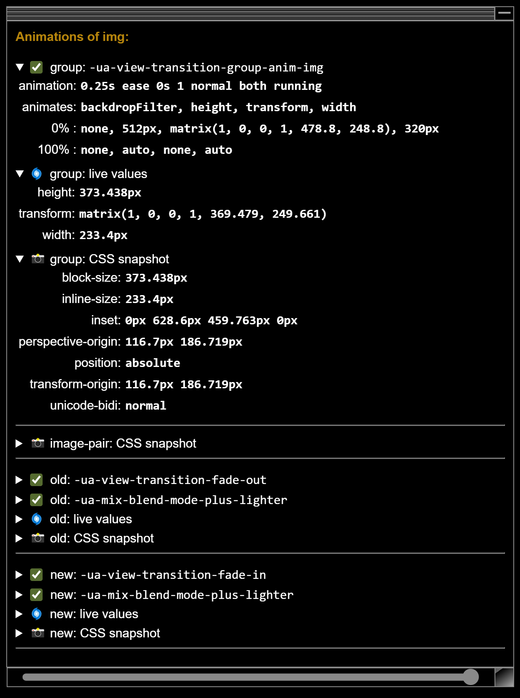
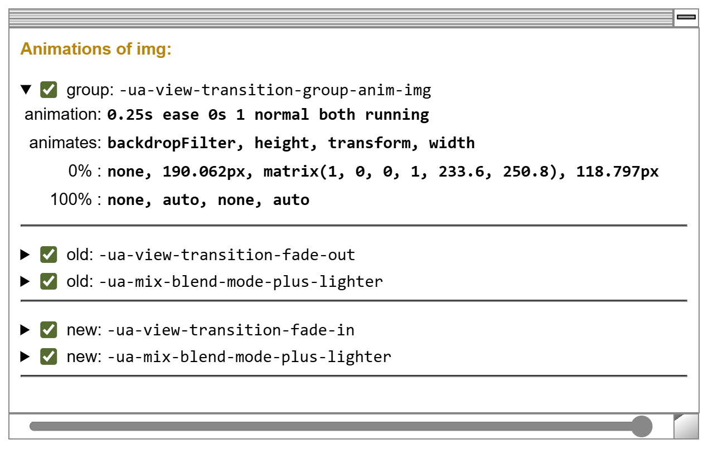

This example resembles he typical teaser & details pattern. The morphing image guides your eyes from the teaser to the details.

### HTML

Similar to the [Basic Same-Document example](/demo/BasicS/), this setup involves two DOM trees that are toggled via the `startViewTransition()` callback. The first DOM tree, the teaser, displays a card containing a small version of an image, while the second DOM tree, the details, represents a detailed view with a heading, descriptive text, and a larger version of the image.

The approach shown here works consistently for both same-document and cross-document view transitions. However, using the same-document variant simplifies a bit the scaffolding required for these examples.

```html
<div id="DOM1" class="active">
  <div class="card">
    
    <div>
      <h4>Teaser Heading</h4>
      <p>This is a teaser text for the card.</p>
    </div>
  </div>
</div>
<div id="DOM2">
  <article>
    <div>
      <h3>Details</h3>
      <p>
        Some text that describes the details of what the card teases in more
        detail. Click &gt;here&lt; to return to teaser view.
      </p>
    </div>
    
  </article>
</div>
```

For the styling of the elements see the source of this page.

### Script Part

The script part adds listeners for the click event to both DOM trees.

```html
<script>
  document.querySelectorAll("#DOM1, #DOM2")
    .forEach(elem => elem.addEventListener("click", (e) => {
      mayViewTransition(() => {
        elem.classList.remove("active");
        elem.parentElement
          .querySelector(elem.id === "DOM1" ? "#DOM2" : "#DOM1")
          ?.classList.add("active");
      })
  }));
  function mayViewTransition(fun) {
    document.startViewTransition ? document.startViewTransition(fun) : fun();
  }
</script>
</div>
````

When clicked, the listener swaps the active class between the two DOM trees.

If you want to learn more about why `mayStartViewTransition()` is used here, see the description in the [Basic Same-Document example](/demo/BasicS/).

### View Transition specific CSS

To define a morph transition from one element to another, you have to assign the same view transition name to both elements. In this example we morph between two images, the card's image and the article's image.

```css
.card img,
article img {
  view-transition-name: img;
}
```

It is not important that the two elements are similar or even have the same tag. Technically, you can morph between any arbitrary elements, e.g. transforming a form into a table. However, achieving a visually appealing result may require some CSS adjustments.

## Inspection Chamber Insights


The built-in morph effect operates as follows:

- At the beginning of the view transition, the group pseudo-element is transformed to match the position and size of the old element. Both the old and new images are rendered on the group pseudo-element.
- As the transition progresses, the group pseudo-element gradually shifts in position and size until it aligns with the new element's dimensions. Throughout this movement, the old and new images continue to be displayed on the group element. While the group's size is interpolated between the start and end states, the specifics of how the old and new images are resized during the transition might involve more complexity. We will explore this further in upcoming examples. In this example where old and new images have the same aspect ratio, the size of the images are also just interpolated.
- During the transition, the new image, which is drawn above the old image, gradually fades in while the old image fades out.


The first two bullet points are implemented by the browser defined `-ua-view-transition-group-anim-img` animation. The last bullet point is implemented by the default fades `-ua-view-transition-fade-out` and `-ua-view-transition-fade-in` of the old and new image.

<span class="light:sl-hidden"></span>
<span class="dark:sl-hidden"></span>

In the panel you see an additional animation for the old and new images: `-ua-mix-blend-mode-plus-lighter` ensures that the colors of the semi-transparent images add up to the original color values and that the sum of those images is never looks under or over exposed.

Everything that is outside of the images where we assigned the view transition name `img` is controlled by the `root` group. As we did not specify something else, this has the default animation: it fades out the card and fades in the detailed view.