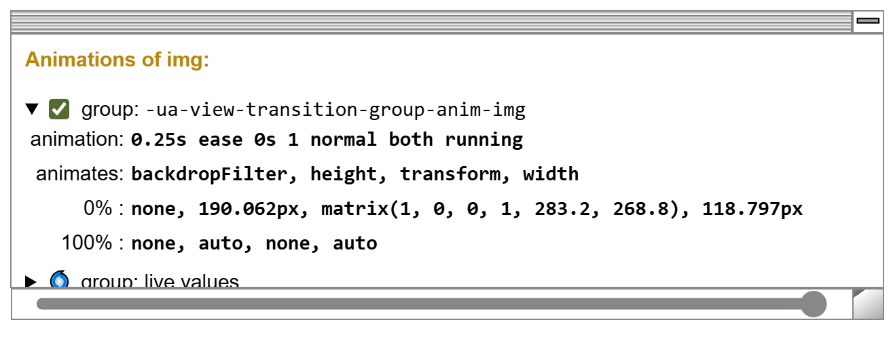
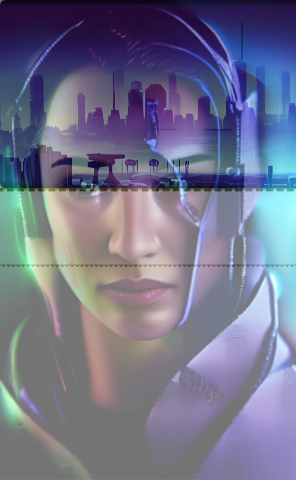

Aside from the images, the current example differs only slightly from the [previous example](/demo/BasicIM/). The changes only alter the size constraints of the article image.

```diff lang="css"
     article div {
       padding: 1rem;
-      max-width: 50%;
+      max-width: 40%;
     }
     article img {
       margin: auto;
-      height: min(512px, 66vh);
+      width: min(400px, 50vw);
       border-radius: 8px;
       box-shadow: 0 2px 2px rgba(0, 0, 0, 0.5);
     }
```


## Inspection Chamber Insights

The browser generated default animations for the view transition API are rather fast. You have 0.25 seconds to seen what's going on.

<span class="light:sl-hidden"></span>
<span class="dark:sl-hidden"></span>

With the inspection chamber, you can examine the details of the default morph animation.

The table below deconstructs the procedure into its individual components. The first row illustrates the progression of the `img` group (golden), transitioning from a portrait orientation at 0%, through a square at 50%, to a landscape orientation at 100%. The outlines at 0% and 100% correspond to the before and after DOMs of the view transition, while the 50% outline represents the interpolated midpoint you might expect to see at the halfway mark.

In our example, the group's outline gradually widens and shortens in height.

<style>{`table {margin: auto} td {vertical-align: top; text-align: center;}`}</style>
<table><tr><td>&nbsp;</td><td>0%</td><td>50%</td><td>100%</td></tr><tr><td>group</td><td><svg width="60" height="80"><g><rect x="10" y="10" width="40" height="60" stroke="#B08600" stroke-width="2" stroke-dasharray="2 4" fill="none"/></g></svg></td><td><svg width="70" height="70"><g><rect x="10" y="10" width="50" height="50" stroke="#B08600" stroke-width="2" stroke-dasharray="2 4" fill="none" /></g></svg></td><td><svg width="80" height="60"><g><rect x="10" y="10" width="60" height="40" stroke="#B08600" stroke-width="2" stroke-dasharray="2 4" fill="none" /></g></svg></td></tr><tr><td>group & old</td><td><svg width="60" height="80"><g><rect x="10" y="10" width="40" height="60" stroke="#B08600" stroke-width="2" stroke-dasharray="2 4" fill="none"/><rect x="10" y="10" width="40" height="60" stroke="#532476" stroke-width="2" stroke-dasharray="8 6" fill="none"/></g></svg></td><td><svg width="70" height="95"><g><rect x="10" y="10" width="50" height="50" stroke="#B08600" stroke-width="2" stroke-dasharray="2 4" fill="none" /><rect x="10" y="10" width="50" height="75" stroke="#532476" stroke-width="2" stroke-dasharray="8 6" fill="none" /></g></svg></td><td><svg width="80" height="110"><g><rect x="10" y="10" width="60" height="40" stroke="#B08600" stroke-width="2" stroke-dasharray="2 4" fill="none" /><rect x="10" y="10" width="60" height="90" stroke="#532476" stroke-width="2" stroke-dasharray="8 6" fill="none" /></g></svg></td></tr><tr><td>group & new</td><td><svg width="60" height="80"><g><rect x="10" y="10" width="40" height="60" stroke="#B08600" stroke-width="2" stroke-dasharray="2 4" fill="none"/><rect x="10" y="10" width="40" height="27" stroke="#275317" stroke-width="2" stroke-dasharray="8 6" fill="none"/></g></svg></td><td><svg width="70" height="70"><g><rect x="10" y="10" width="50" height="50" stroke="#B08600" stroke-width="2" stroke-dasharray="2 4" fill="none" /><rect x="10" y="10" width="50" height="33" stroke="#275317" stroke-width="2" stroke-dasharray="8 6" fill="none" /></g></svg></td><td><svg width="80" height="60"><g><rect x="10" y="10" width="60" height="40" stroke="#B08600" stroke-width="2" stroke-dasharray="2 4" fill="none" /><rect x="10" y="10" width="60" height="40" stroke="#275317" stroke-width="2" stroke-dasharray="8 6" fill="none" /></g></svg></td></tr><tr><td>group & old & new</td><td><svg width="60" height="80"><g><rect x="10" y="10" width="40" height="60" stroke="#B0860044" stroke-width="2" stroke-dasharray="2 4" fill="none"/><rect x="10" y="10" width="40" height="60" stroke="#532476" stroke-width="2" stroke-dasharray="8 6" fill="none"/><rect x="10" y="10" width="40" height="27" stroke="#27531744" stroke-width="2" stroke-dasharray="8 6" fill="none"/></g></svg></td><td><svg width="70" height="95"><g><rect x="10" y="10" width="50" height="50" stroke="#B0860088" stroke-width="2" stroke-dasharray="2 4" fill="none" /><rect x="10" y="10" width="50" height="75" stroke="#53247688" stroke-width="2" stroke-dasharray="8 6" fill="none"/><rect x="10" y="10" width="50" height="33" stroke="#27531788" stroke-width="2" stroke-dasharray="8 6" fill="none" /></g></svg></td><td><svg width="80" height="110"><g><rect x="10" y="10" width="60" height="40" stroke="#B0860044" stroke-width="2" stroke-dasharray="2 4" fill="none" /><rect x="10" y="10" width="60" height="90" stroke="#53247644" stroke-width="2" stroke-dasharray="8 6" fill="none"/><rect x="10" y="10" width="60" height="40" stroke="#275317" stroke-width="2" stroke-dasharray="8 6" fill="none" /></g></svg></td></tr></table>

The next row demonstrates the transition of the old image (purple) as if it didn’t fade out. By default, the View Transition API sets the old image's width to match the group shown in the first row, but it doesn’t adjust the height to the group's height, as that would distort the image. Instead, it preserves the image's aspect ratio.

The browser generated CSS that is responsible for this trick is this:
```
::view-transition-new(*),
::view-transition-old(*) {
    inline-size: 100%;
    block-size: auto;
}
```

As the group expands to 150% of its original width, the old image similarly scales up to 150% of its original height and is always larger than the group.

The third row illustrates the transition of the new image (in green) as if it didn’t fade in. Here again, the width is matched to the group's width while maintaining the aspect ratio. As a result, the image expands along with the group, but remains proportionally smaller.

Finally the last rows shows the combined effect and also hints a bit on the fade in and out of the images.

In real, the middle picture of the last row looks like this:

<style>{`#mix img {max-height:66vh; width:auto}`}</style>
<span id="mix"></span>

The [next example](/demo/BasicIM3/) shows an alternative styling that is less overwhelming.