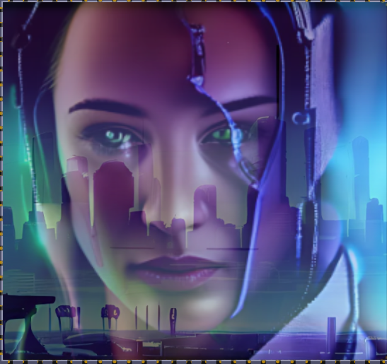
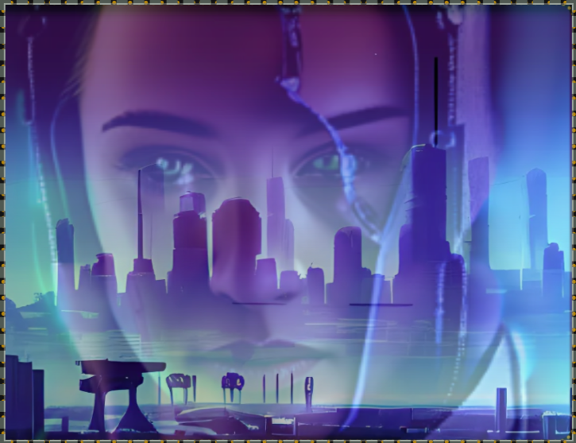

In this example, both the old and new images are sized to match the group, or more specifically, the size of the image-pair within the group.

This setup works well at the edges: At 0% the group matches the dimensions of the old image, and at 100% the group matches the size of the new image. However, at the midpoint (50%), both images are partially visible. Forcing them into the group's square shape at this stage would certainly distort them.

```css ins={1-8}
  ::view-transition-old(img),
  ::view-transition-new(img) {
    overflow: clip;
    height: 100%;
    width: 100%;
    object-fit: cover;
    object-position: 100% 40%;
  }
```
However, there is a way to maintain the aspect ratio, even within the square, by resizing the images and displaying only a section of them. We use `object-fit: cover` to enlarge the images just enough to fill the entire square.

Now we can adjust the vertical position of the portrait: 40% is ideal to maintain eye contact and avoid cutting off the jaw. We can also choose where the landscape should be anchored. With a value of 100%, the right edge of the image stays fixed, and the view opens to the left as the image slides in.


## Inspection Chamber Insights


Here are the detailed pictures as seen with the inspection chamber

<div id="mix">
<span></span>
<span></span>
<span></span>
</div>

<style>{`
#mix {
  display: flex;
  flex-direction: column;
}
#mix img {
  max-height: 25vh;
  width: auto;
  justify-content: space-between;
  margin: 1rem auto;
}`}</style>