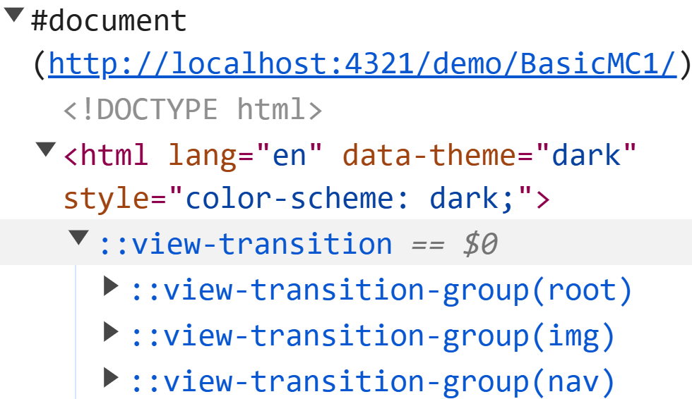
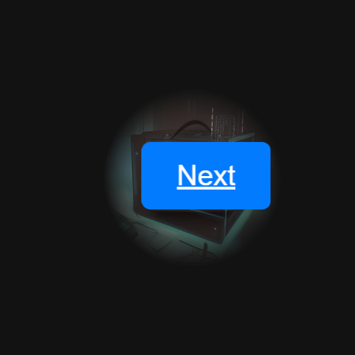
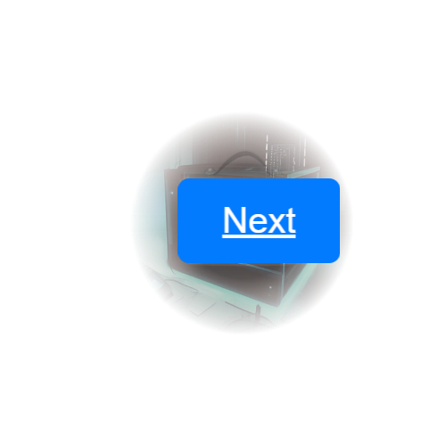
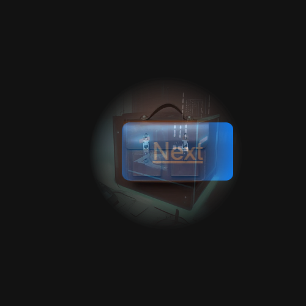
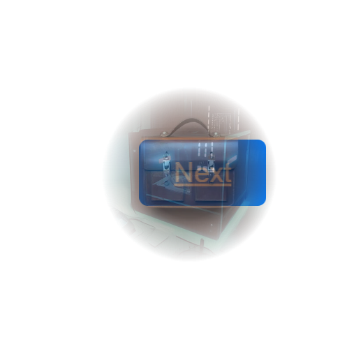

import { Steps } from "@astrojs/starlight/components";

### Goal

When the `Next` button is pressed, it should slide out to the left and the next instance should slide in from the right.

### Changes

We built on the [former example showing one custom animation](/demo/BasicAC1/). The extensions are CSS only.

#### View Transition Names

As you might have guessed, the new animation needs a new view transition name.

```html ins={1-3}
.nav-button { view-transition-name: nav; }
```

This also has to be done on the second page for the nav button there.

#### Custom Animations

The key is to imagine a canvas where the new image of the button starts one screen width to the right, outside the viewport. Then, both images, the old one and the new one, are slid to the left. This moves the old image off the screen while the new one slides into view.

```css ins={1-6}
::view-transition-old(nav) {
  animation: 1s ease-in-out slideOut;
}
::view-transition-new(nav) {
  animation: 1s ease-in-out slideIn;
}
```

We want the animation to take up some speed and than getting slower while falling into place.

#### Keyframes

The sliding animation is handled by two keyframes:

The old image moves from its current position to a point that is 100% of the viewport's width to the left. Simultaneously, the new image slides in from a point that is 100% of the viewport's width to the right.

```css ins={1-10}
@keyframes slideOut {
  to {
    transform: translateX(-100vw);
  }
}
@keyframes slideIn {
  from {
    transform: translateX(100vw);
  }
}
```

## Inspection Chamber Insights

Does the button slide in front of or behind the picture? View transition groups stack according to the drawing order of their elements. Groups from the old page are rendered first, followed by those defined only on the new page.

### Examine the Stacking Order of View Transition Groups

You can check the order by examining the pseudo elements of the view transition in the browser's DevTools. These elements are only visible during the typically very short execution of the view transition. However, you can use the inspection chamber to freeze the animation and examine the pseudo elements for as long as necessary.

1. Start the view transition in the inspection Chamber in Full Control mode
2. Click on any name in the name list
3. Paste to the console window of the browser's DevTools and press <kbd>Enter</kbd>.
4. Now in the "Elements" view of the DevTools, expand the `<html>` element and the `::view-transition` pseudo element.

<div id="pseudos">
  <span class="light:sl-hidden">
    
  </span>
  <span class="dark:sl-hidden">
    
  </span>
</div>
<style>{`#pseudos img {width:max( 33vw, 300px)}`}</style>

In our example, the 'Next' button appears after the `` element in the HTML source. As a result, the transition group for the button is closer to the viewer than the picture's group and the old image of the button will obscure the picture when it slides by.

### Change the Stacking Order of View Transition Groups

We want to change the stacking order so that the button slides behind the picture. Of course we could swap the order of the `` and the `<a>` element in the HTML source.

But there is also a CSS only solution for view transition groups. And it is surprisingly simple as we just apply the standard mechanism here: we give the picture's view transition group a (higher) z-index:

```css ins={}
::view-transition-group(img) {
  z-index: 1;
}
```

In Full Control mode of the Chamber, you can observe the button's transition as it moves through the picture. The screenshots below show the outcome without the z-index setting (left) and when z-index is set (right):

<div id="flex">
  <div>
    <span class="light:sl-hidden"></span>
    <span class="dark:sl-hidden"></span>
    <p>
      Old image of the button in front of the pseudo-elements of the picture.
    </p>
  </div>
  <div>
    <span class="light:sl-hidden"></span>
    <span class="dark:sl-hidden"></span>
    <p>
      Semi-transparent pseudo-elements of the picture in front of the old image
      of the button.
    </p>
  </div>
</div>

<style>{`
#flex {
  display: flex;
  flex-wrap: wrap;
  justify-content: space-around;

}
#flex div {
  width: max(40%, 300px)
}
`}</style>
