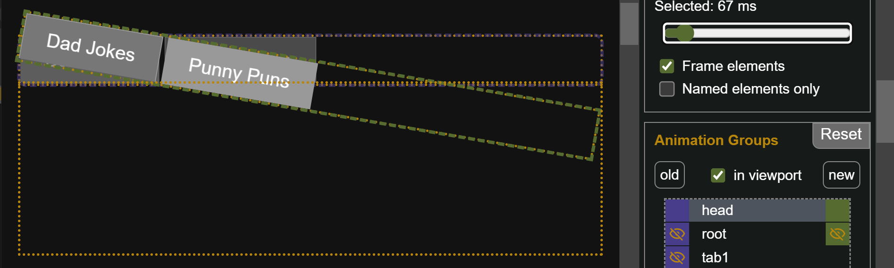
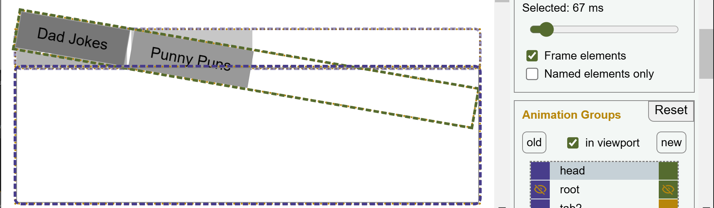
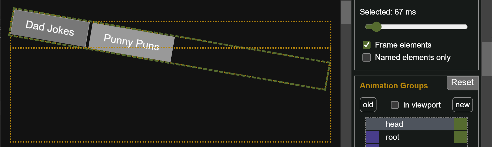
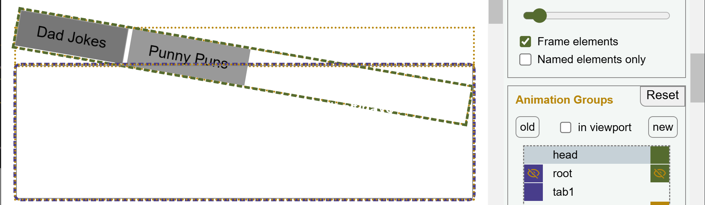

### Goal

We want to emphasize the heading a bit by giving it a little shake during the view transition.

### Changes
The code of this example is identical with the [example using a single custom animation](/demo/BasicAS/). The extensions are pure CSS.

#### View Transition Name

Because we want to define an animation for the head, we need to give it a new view transitions name:
```css ins={1-3}
.tabs {
  view-transition-name: head;
}
```

#### Custom Animation

The next step is to determine what is to be animated and how. The new image sits above the old image and obscures it. We could shake both images, or just animate the new one while hiding the old one, so it doesn't peek out from under the new image during the shaking. Here is how this is done:

```css ins={1-7}
::view-transition-old(head) {
  display: none;
}
::view-transition-new(head) {
  animation: shake 0.75s ease-out ;
  transform-origin: 120px 20px;
}
```

#### Keyframes

Finally, the keyframes for the shaking must be defined:

```css ins={1-7}
@keyframes shake {
  10% { transform: rotateZ(10deg); }
  30% { transform: rotateZ(-10deg); }
  50% { transform: rotateZ(10deg); }
  70% { transform: rotateZ(-10deg); }
  90% { transform: rotateZ(10deg); }
}
```
## Inspection Chamber Insights

When animating only the new image, checking the time frame around 67 ms will reveal whether the old image shows through or not. Even though the browser's default animation fades out the old image, at 67 ms, it's still opaque enough to be noticeable. Here's what it looks like if you omit the `display: none` rule for `::view-transition-old(head)`:

<span class="light:sl-hidden"></span>
<span class="dark:sl-hidden"></span>

You might find that the fading old image adds an interesting effect to the shaking, creating an impression of motion and speed. That could be true.

If you prefer the cleaner look with the `display: none` rule above, this is how it looks in detail.


<span class="light:sl-hidden"></span>
<span class="dark:sl-hidden"></span>

Have you noticed how wide the frame of the `div.tabs` is?