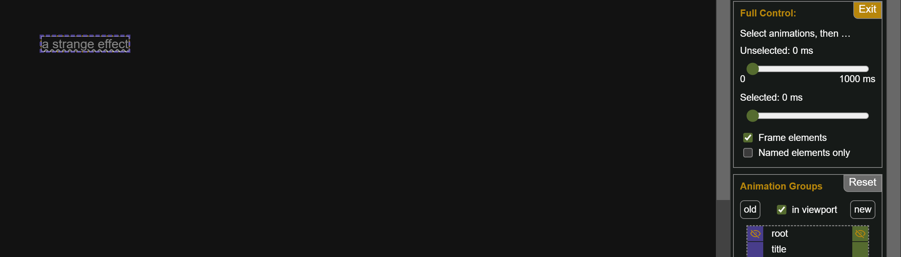
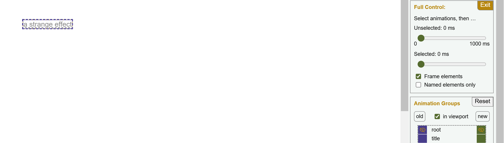
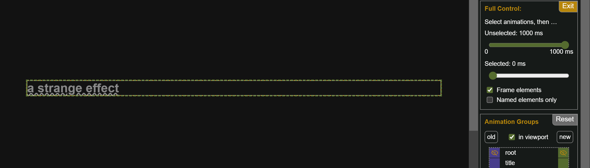
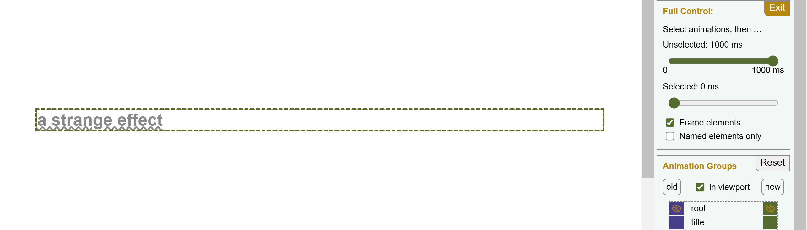
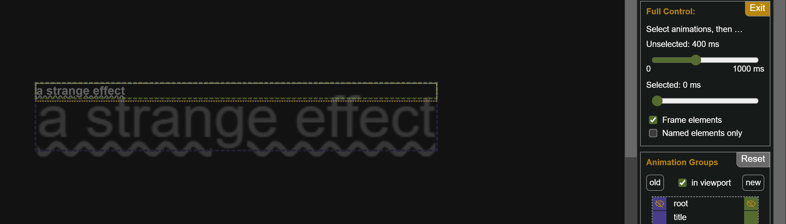
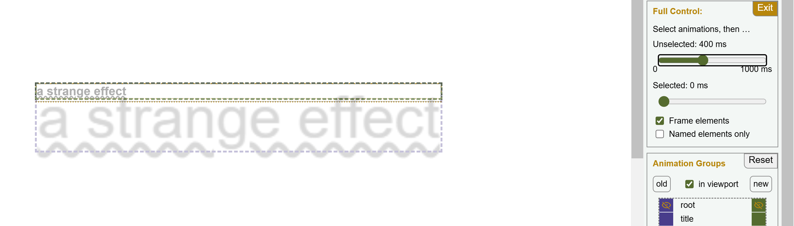

The link and heading share the same text content, text decoration, and view transition name. However, the transition effect is not a simple movement of text from the link to the heading. Instead, the link significantly enlarges before fading out, while the heading fades in with low visual impact.

### Effect Details

Despite the link and heading having nearly the same height, with the heading only slightly taller, the transition shows the link's text becoming excessively large. Why does this happen?

To understand this, we need to examine the bounding boxes of both elements and their transition group throughout the animation.

After hiding the old and new images of the root transition group, the Chamber shows this: at the start of the transition, there is only the old image of the link, enclosed in its purple bounding box. The orange box of the transition group is almost completely hidden underneath. At the beginning it has the same size as the old image. Initially, the width of the boxes is just large enough to contain the link's text.

By the end of the transition, the old image has morphed into the new image of the heading, outlined by its green bounding box. The orange box of the transition group has expanded to match the new image's dimensions. It now spans the entire width of the headings parent, which is significantly wider than the text itself.

The next image shows the transition at 40% of the timeline. The group's orange box is now partway between the width of the text and the full width of the parent container.

As we have already seen with image morphs, both the old image's and the new image's bounding boxes are [constrained to share the width of the transition group](/demo/BasicIM2/) and the view transition preserves the aspect ratios of the original images.

Consequently, the link box that grows a lot in width gradually also gets a really large height before it fades. The heading image on the other side is forced into a very narrow box at the beginning, which forces the height to be real small while it fades in. Thus, the effect on the heading looks rather unspectacular.

## How to fix?

Head over to the [solution section](/demo/Improved1/)!