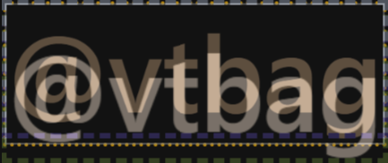

The video may not clearly demonstrate this, but the transition appeared somewhat jerky. A closer examination of the effect revealed the following detail:


<span class="light:sl-hidden"></span>
<span class="dark:sl-hidden"></span>

Why is this happening? Both elements are `<h1>` headings with identical text, and unlike the [last example](/demo/Fail1/), we don't have the issue of one text being displayed inline while the other is block-level.

Once again, the root cause is differing aspect ratios, which is clearly visible in the browser's devtools.

<div style="display: flex; flex-wrap: wrap; align-items:flex-end">
  <div style="flex: 1 1 333px">
    <span class="light:sl-hidden">
      
    </span>
    <span class="dark:sl-hidden">
      
    </span>
    <p>The text on the homepage has no special styling applied. The box just covers the text. Both margins and padding set to zero.</p>
    </div>
  <div style="flex: 1 1 333px">
    <span class="light:sl-hidden">
      
    </span>
    <span class="dark:sl-hidden">
      
    </span>
    <p>However, on the overview page, the heading includes a large top margin along with smaller padding on the top and bottom.</p>
    </div>
</div>


## How to fix?

The issue is resolved by applying consistent styling to both headings. To avoid interfering with Starlight's default styles, the same padding and margins were added to the hero page heading via a `custom.css` file.

```css
.hero h1 {
  margin-top: 1.5rem;
  padding-top: 8px;
  padding-bottom: 2px;
 }
```
I also made the `@vtbag` string on the hero page and the `@vtbag: Overview` string on the overview page the same length. How? By adding "&emsp;&emsp;&emsp;&emsp;&ensp;&thinsp;" to the shorter one.

Did it work? Visit the [home page](/), click the "Open the Bag" button, and see for yourself!

<span class="light:sl-hidden"></span>
<span class="dark:sl-hidden"></span>

Good enough!