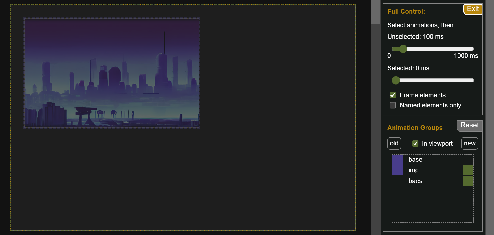
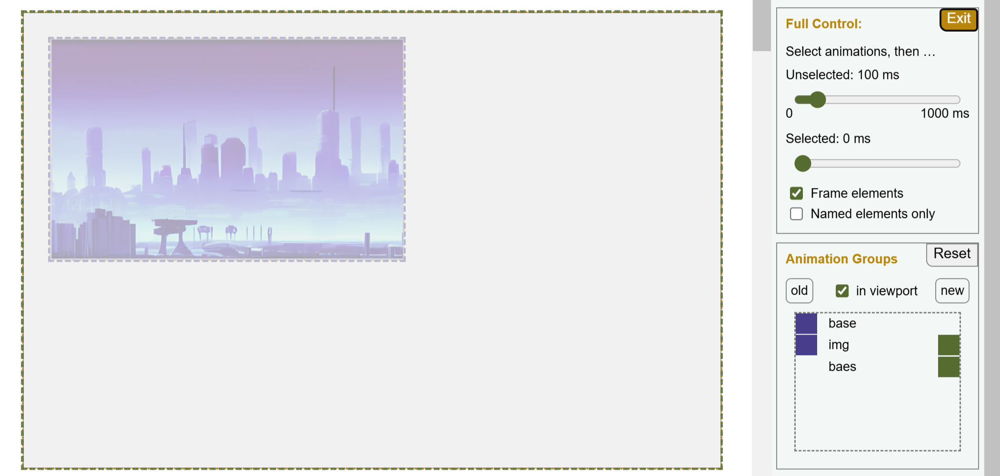
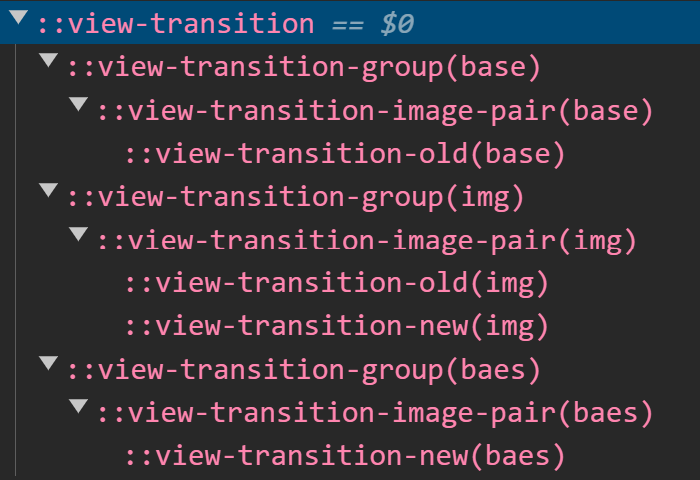
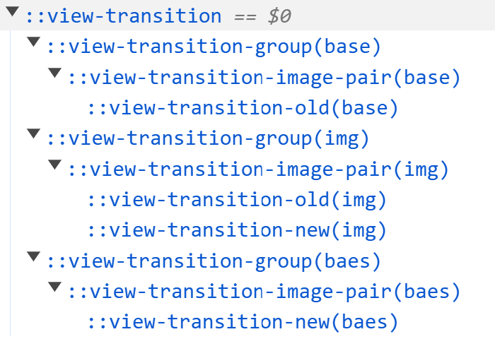

The HTML of this example is very simple:

```html
<div>
  <div id="DOM1" class="active">
    
  </div>
  <div id="DOM2">
    
  </div>
</div>
<style>
  img {
    view-transition-name: img;
  }
</style>
```
The view transition swaps the two DOMs, each containing a background div and an image.


The key to understanding this example lies in the order in which the `::view-transition-group` pseudo-elements [are created](/basics/pseudos/#creation-of-pseudo-elements) by the API and [hide each other](/basics/pseudos/#rendering-pseudo-elements).


When snapshots of the new images are taken in the new DOM, the `::view-transition-new` pseudo-elements are added to existing transition groups based on their transition names. These groups either already exist if there is an old image with the same name or they are created created on the fly. Elements that only exist in the new DOM will create new groups at the end of the list. When rendered, these late additions may obscure other images.

If a large, single-color image fades in and covers the rest, it gives the appearance that the other images are fading out. This is what's happening here. Due to a typo, the new background image isn’t assigned to the existing transition group and instead covers the entire scene. This effect persists until the view transition completes, at which point all images are removed and the temporary “ghosting” effect disappears abruptly.


If a large unicolor image covers all the other images and fades in, this looks just the same as if the other images would fade out. This is exactly what happens above. Due to a typo, the new image for the monochrome background is not assigned to the existing `base` transition group in the background. Instead, it’s added to a new group at the end of the group list, causing it to render on top of all others groups. The background image fades over the scene, obscuring the view until the transition completes.


```css
#DOM1 {
  padding: 25px;
  view-transition-name: base;
  width: 600px;
  height: 375px;
}
#DOM2 {
  padding: 25px;
  view-transition-name: baes;
  width: 600px;
  height: 375px;
}
```


Can you spot the typo in the CSS above?

The Inspection Chamber provides a more detail view: In Full Control Mode during an active transition, the Animation Groups panel lists the groups in the order in which they were created: `base`, `img`, `baes`. The purple and green patches next to the group names indicate whether the group contains an old image, a new image, or both. Instead of having a `base` group with both the old and new images, the `base` group includes only the old image, while the mistakenly named `baes` group holds the new image.


<span class="light:sl-hidden"></span>
<span class="dark:sl-hidden"></span>

As a result, the `baes` group obstructs the view of the `img` group. Thanks to the still-image functionality of the Chamber we can further verify this by examining the view transition's pseudo-elements, which reveal the same outcome.

<div style="width: 400px; margin: 0 auto;">
<span class="light:sl-hidden"></span>
<span class="dark:sl-hidden"></span>
</div>

The `baes` group ends up covering the `img` group.

## How to fix?

The fix is straightforward. Replacing the second view transition name with `base` resolves the issue. Now, both large `div`s are correctly positioned in the background, allowing the image to morph smoothly without being obscured.