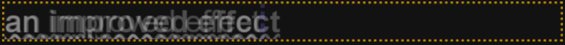
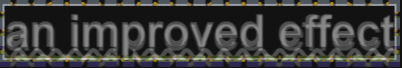
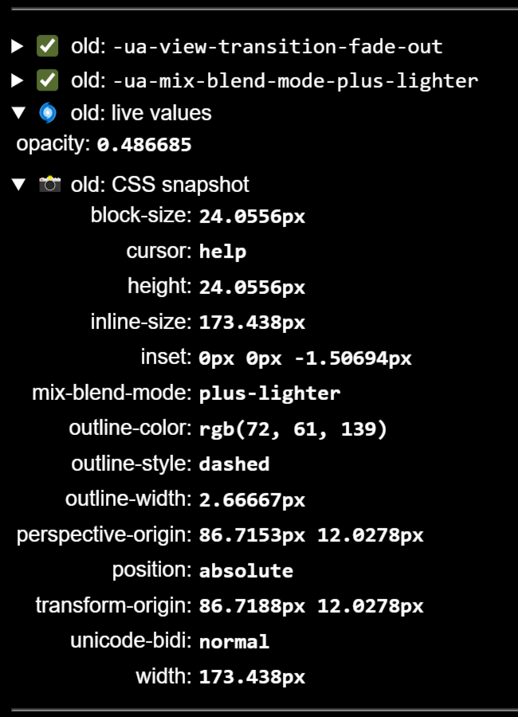
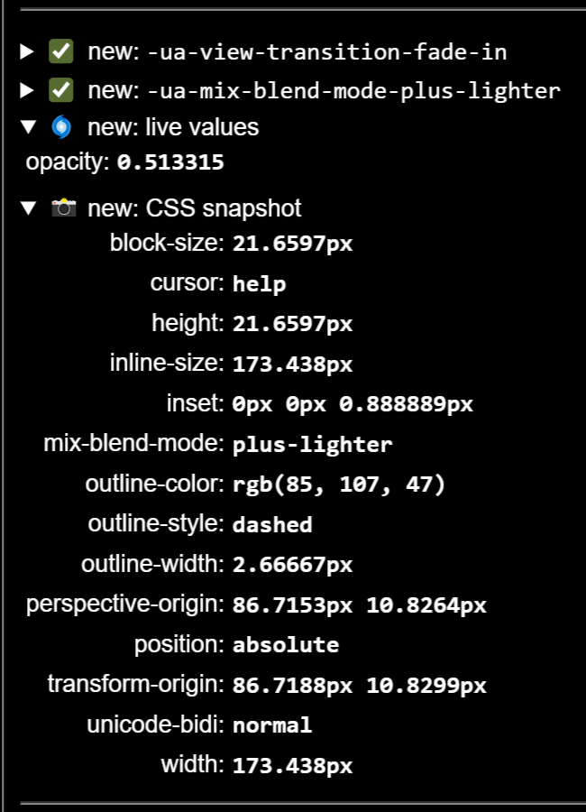
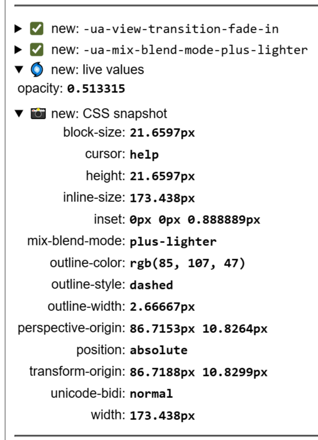
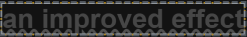

In the analysis of the [failing transition](/demo/Fail1/), discovered that although the link and heading appeared visually similar, their aspect ratios differed. The unexpected text enlargement of the link was caused by the [default behavior of morph transitions](/basics/default-animations/#how-the-boxes-morph), where both the old and new images expand to fit the width of the group's pseudo-element while maintaining their original aspect ratios.

There are (at least) two possible solution:

- Adjust the mechanics of morph animations to prioritize height over width, as we did for image morphs.
- Decrease the width of the heading so that both elements share the same aspect ratio.

### Prioritize Height Over Width?

Clipping the images at the group's bounding box and forcing the image heights to match the group's height worked well in [this image morphing example](/demo/BasicIM3/). Could this approach also resolve the text morph issue? Let's add the following CSS and observe the result in the Inspection Chamber.

```css
::view-transition-group(title) {
  overflow: clip;
}
::view-transition-old(title),
::view-transition-new(title) {
  block-size: 100%;
  inline-size: auto;
}
```

This is a significant improvement over the previous version!

<span class="light:sl-hidden">
  
</span>
<span class="dark:sl-hidden">
  
</span>

The images of the link and the heading now both fill the height of the group's box and are scaled to keep the aspect ratio. A faint purple line marks the end of the old image, but the new image is wider. Its borders are hidden and clipped by the orange border of the group; otherwise, it would extend significantly to the right.

Since the aspect ratios remain quite different, the two elements are stretched to varying degrees, causing the letters to mis-align slightly. We still need to address the root issue.

### Make the Heading as Short as the Link

To achieve a better solution where the letters of the two images align, we need to eliminate the empty space on the right side of the heading to better match the aspect ratio to the link.

There are several ways to do this. The main reason for the different ratios is that the heading, as a block-level element, uses up 100% of its parent's width. So let us change the box of the heading to `inline` to remove that extra space:

```css
h2 {
  display: inline;
}
```

Now we're making progress.

<span class="light:sl-hidden"></span>
<span class="dark:sl-hidden"></span>

Here we do not need any clipping and all three borders are visible. More so, the orange border of the group, the purple border of the old image and the green border of the new image ar all the same and neatly align. And so does the text inside the boxes.

Here, no clipping is needed, and all three borders are visible. In fact, the orange border of the group, the purple border of the old image, and the green border of the new image are identical and perfectly aligned. The text inside the boxes also aligns neatly.

'Hmm, yes. But it's still not pixel-perfect?'

'True, but the solution works well enough. It's not perfect, but it'll do for now. I doubt anyone would notice without using the still-image feature in the Inspection Chamber!'

### Why is it&hellip;

Even though the link and the heading are now both rendered inline, they do not produce the exactly same images. The heading has a bit larger font. Thus the link's image must be scaled to match the heading's image which will introduce rounding errors.

  <div style="display: flex; flex-wrap: wrap;">
    <div style="flex: 1 1 333px">
      <span class="light:sl-hidden">
        
      </span>
      <span class="dark:sl-hidden">
        
      </span>
    </div>
    <div style="flex: 1 1 333px">
      <span class="light:sl-hidden">
        
      </span>
      <span class="dark:sl-hidden">
        
      </span>
    </div>
  </div>

### &hellip;and can we do better?

If we morph between two identical strings with identical styling, the transition would also be pixel perfect. Here is what you can get:

<span class="light:sl-hidden">
  
</span>
<span class="dark:sl-hidden">
  
</span>

But who want's links that look like headings or headings that look like links?

That's not really necessary. If the two texts are similar enough and you managed to display both inline with consistent margin, border, and padding, you can try explicitly setting both the width and height of the pseudo-elements to 100%. This gives both images the size of the transition group. It might cause slight distortions, but under these conditions, they are hardly noticeable.

```css
::view-transition-old(title),
::view-transition-new(title) {
  width: 100%;
  height: 100%;
}
```